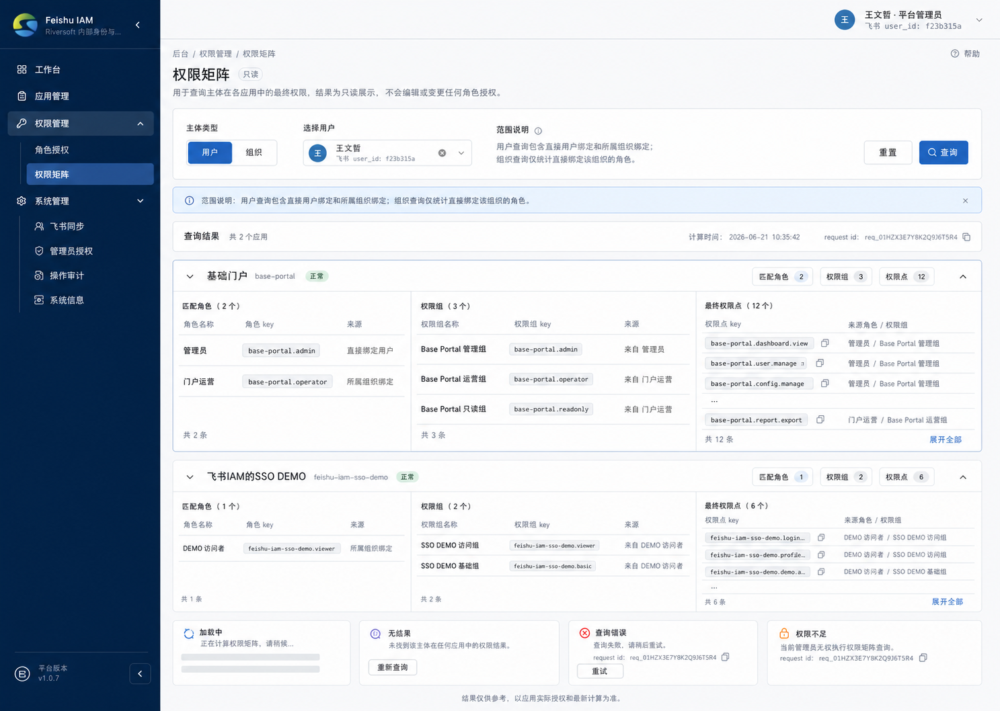
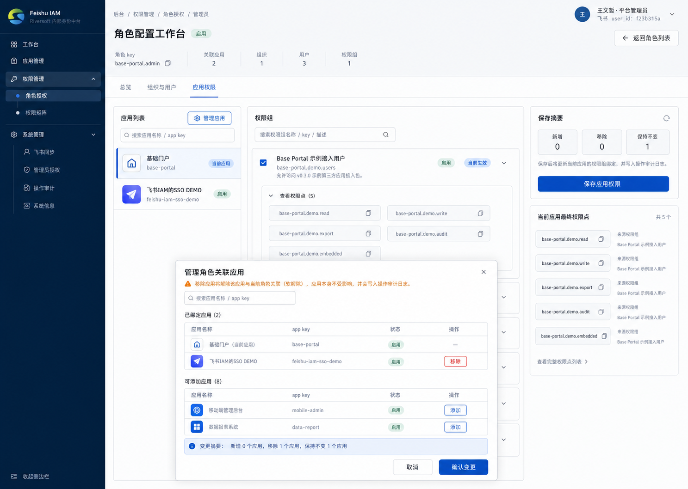
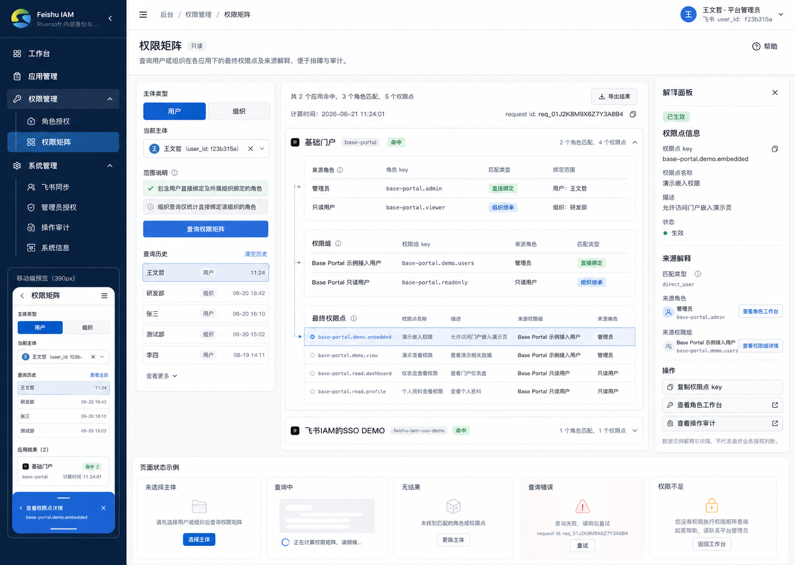

# Feishu IAM v1.0.7 权限管理视觉方向

生成时间：2026-06-21 11:38 CST。

## 设计 Brief

本轮设计目标是为 `v1.0.7 权限管理信息架构收敛` 提供视觉目标候选，不进入业务代码实现。

版本边界：

- 一个版本完成 S1 角色工作台减负和 S2 权限矩阵 MVP。
- 不拆分 `v1.0.8`。
- 不扩大权限模型，不实现 ABAC、资源级权限、deny 规则或数据范围权限。
- 不做全站主题重构。

设计基线：

- 企业后台 Admin Console。
- shadcn/ui + tweakcn modern neutral admin。
- Riversoft 蓝色系主操作，深蓝侧边栏，浅灰蓝背景，白色内容面板。
- 中等信息密度，表格、筛选、弹框、状态完整。
- 不使用营销页、hero、大面积渐变、装饰卡片或低密度展示型 dashboard。

参考输入：

- `AGENTS.md`
- `DESIGN.md`
- `docs/superpowers/specs/2026-06-21-feishu-iam-v1.0.7-permission-management-prd.md`
- `docs/design-audits/2026-06-21-permission-management-next-prd/audit-notes.md`
- `docs/design-audits/2026-06-21-permission-management-next-prd/step2-product-design-planning-review.md`
- 线上截图：权限管理角色列表、角色工作台总览、应用权限页。

## 视觉方向 A：Matrix First

图：`01-matrix-first.png`

定位：优先锁定 `权限矩阵` 页面，把主体查询、范围说明、应用分组结果和页面状态作为主视觉目标。

适合：

- 快速验证 S2 权限矩阵信息架构。
- 明确 `权限矩阵` 是只读查询入口。
- 展示按应用分组的匹配角色、权限组和最终权限点。

优点：

- 页面结构清楚：查询区、范围说明、结果区、状态区分明。
- 与 `系统管理` 二级导航一致，左侧可直接看到 `角色授权 / 权限矩阵`。
- 加载、无结果、查询错误、权限不足状态覆盖较完整。
- 权限点 key、角色 key、权限组 key 使用紧凑技术标识展示，适合后续实现复制和 tooltip。

风险：

- 更偏 S2，不能单独作为 S1 角色工作台和应用弹框的视觉目标。
- 应用分组结果密度较高，390px 需要明确改为应用卡片或折叠面板。

## 视觉方向 B：Role Workbench First

图：`02-role-workbench-first.png`

定位：优先解决 S1 角色工作台减负和 `管理角色关联应用` Dialog。

适合：

- 作为本版本 S1 的主要视觉目标。
- 直接指导移除 `角色上下文`、`基础信息` tab、`变更记录` tab。
- 明确 `应用权限` tab 只保留当前应用权限组绑定和最终权限点核对。

优点：

- PageHeader 直接承接角色 key、关联应用、组织、用户、权限组数量，替代旧的独立 `角色上下文` 卡片。
- 角色工作台 tab 收敛为 `总览 / 组织与用户 / 应用权限`。
- `管理角色关联应用` Dialog 同时覆盖搜索、已绑定、可添加、移除、变更摘要和审计提示。
- 右侧只保留保存摘要和当前应用最终权限点，不再展示 `权限点对比`。
- 与现有代码的 `PermissionRoleDetailSheet` / `ResponsiveTabsList` / Dialog 模式贴近，实施风险低。

风险：

- 权限矩阵只通过侧边栏入口出现，没有完整展示 S2 结果页细节。
- Dialog 中应用列表较长时需要补充滚动边界和 390px 单列分区规则。

## 视觉方向 C：Traceable Permissions

图：`03-traceable-permissions.png`

定位：优先服务排障人员，强调权限来源解释、request id、操作审计和移动端可用性。

适合：

- 作为 S2 权限矩阵的增强视觉目标。
- 指导“为什么用户拥有某个权限点”的解释面板。
- 补齐 390px 下权限矩阵的卡片和底部 Sheet 形态。

优点：

- 左侧查询 rail 区分主体类型、当前主体、范围说明和查询历史。
- 中央按应用分组展示来源角色、权限组、最终权限点。
- 右侧解释面板能展示选中权限点的来源角色、来源权限组、匹配类型、复制、跳转角色工作台和操作审计。
- 同屏包含移动端预览和状态示例，能约束 390px 实现不退化成宽表格。

风险：

- 信息量最大，首版若全部实现会增加前端复杂度。
- 解释面板最好作为 S2 MVP 的可选增强，工程评审需确认后端来源解释字段是否足够。

## 系统推荐

推荐选择 D：以方向 B 为主视觉目标，吸收方向 C 的权限矩阵解释面板和移动端形态，方向 A 作为权限矩阵分组结果的信息密度参考。

原因：

- 本版本先要保证 S1 角色工作台减负不回退，方向 B 最贴近当前页面和现有组件。
- S2 权限矩阵需要解释来源，方向 C 的解释面板比方向 A 更适合排障主路径。
- 方向 A 的应用分组结果更克制，可作为 S2 桌面结果区的密度参考，避免方向 C 过重。

推荐落地组合：

1. 左侧导航：采用方向 B/C 的二级导航，`权限管理` 展开后显示 `角色授权 / 权限矩阵`。
2. 角色授权列表：沿用当前列表结构，修复 `创建角色` disabled；平台管理员点击后在创建弹框内选择应用。
3. 角色工作台：采用方向 B，移除独立 `角色上下文`、`基础信息` tab、`变更记录` tab。
4. 应用权限：采用方向 B，保留左应用列表、中权限组、右保存摘要与当前应用最终权限点。
5. 管理应用 Dialog：采用方向 B，补充 390px 下 `已绑定 / 可添加 / 变更摘要` 单列分区。
6. 权限矩阵：采用方向 C 的查询 rail + 解释面板，结果密度参考方向 A。
7. 状态覆盖：采用方向 A/C 的未选择主体、查询中、无结果、错误、权限不足状态。

## 390px 设计约束

- 侧边栏进入移动 Sheet；`权限管理` 展开后显示 `角色授权 / 权限矩阵`。
- 角色列表改为行卡片或关键列列表，操作收纳为 `更多`。
- 角色工作台 tab 使用横向滚动或 Select，不得撑破视口。
- 应用权限不使用三列布局，改为分段：当前应用、权限组、保存摘要。
- `管理角色关联应用` Dialog 改为单列：搜索、已绑定、可添加、变更摘要。
- 权限矩阵结果按应用折叠卡片展示；解释面板改为底部 Sheet。
- 所有按钮保持 44px 触控目标，按钮文字不得内部断行。

## 状态设计要求

必须进入后续设计评审和实现验收的状态：

- 角色授权列表 loading / empty / API error / no permission。
- 创建角色弹框未选择应用的字段级错误。
- 角色工作台 read-only、保存中、保存失败。
- 应用管理 Dialog 搜索无结果、移除当前应用、提交中、提交失败。
- 权限矩阵未选择主体、查询中 skeleton、无结果、查询错误带 request id、权限不足。

## D1 选择门禁

| 决策 | 选项 | 推荐 | 影响 |
|---|---|---|---|
| D1 最终视觉目标 | A 采用 Matrix First；B 采用 Role Workbench First；C 采用 Traceable Permissions；D 采用 B 为主并吸收 C/A | D | 选择后进入 Step 4 Product Design review。 |

如果选择 D，后续 Step 4 应重点审查组合后的视觉目标是否过重，并把 C 的解释面板限定为权限矩阵 MVP 的必要解释能力，不扩成通用 BI 报表。

## 已确认选择

用户已确认选择 D1/D。

Step 4 评审记录：

- `selected-visual-target-review.md`

评审结论：通过，无关键设计阻塞；下一步进入 Step 5 `gstack /plan-eng-review`。
