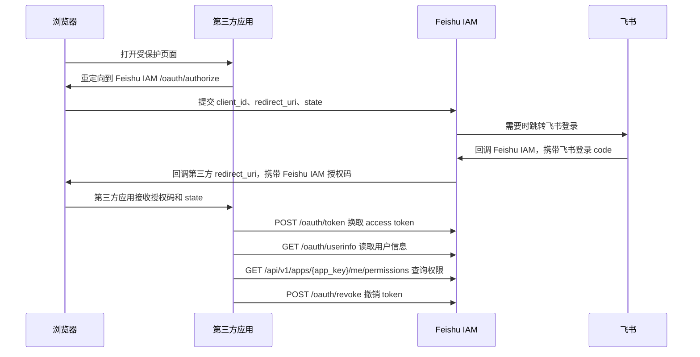

# Feishu IAM SSO Provider 接入指南

## 适用范围

本文档适用于接入 Feishu IAM SSO Provider 的内部 Web 系统。`v0.8.1` 起，管理员创建应用时会同时生成应用级回调地址、默认 OAuth 凭证、开发者 API 凭证和可复制的 Codex 接入提示词。`v1.0.3` 起，应用详情提供 `刷新凭证并生成完整提示词` 主流程，用于重新生成包含 `client_secret` 和 `developer_api_token` 的完整提示词。该 SSO Provider 能力实现授权码流程子集，支持第三方应用通过 Feishu IAM 登录、换取 Feishu IAM access token、读取当前用户信息，并查询当前用户在指定应用下的权限组和权限点。

本文档不适用于完整 OIDC、SAML、refresh token、资源级权限、ABAC、飞书角色同步或飞书用户组同步场景。第三方应用只接入 Feishu IAM，不保存飞书 `app_id`、飞书 `app_secret` 或飞书 OAuth code。

## 接入流程



## 接入前置条件

1. 管理员已在 Feishu IAM 创建应用，并保存 `app_key`。
2. 管理员已在应用中登记一个或多个精确回调地址。
3. 管理员已通过应用详情复制创建时展示的完整提示词，或在 `开发信息` Tab 通过 `刷新凭证并生成完整提示词` 获取新的 `client_id`、`client_secret` 和 `developer_api_token`。
4. 第三方系统后端具备安全保存 `client_secret` 和 `developer_api_token` 的能力。
5. 飞书身份镜像中存在可登录用户，且用户未禁用、未离职、未删除。

回调地址规则：

- 必须是完整 URL。
- 必须与 Feishu IAM 登记值完全一致。
- 不支持通配符、前缀匹配或正则匹配。
- 配置 HTTP 就允许该精确 HTTP 回调，配置 HTTPS 就允许该精确 HTTPS 回调。

`v0.5.0` 起，Web 管理端写操作通过管理员 session 和固定后台角色校验，管理员日常操作不再依赖前端注入平台 token；平台 token 仍保留给自动化和运维脚本。

## 完整接入提示词

管理员进入应用详情的 `开发信息` Tab 后，应优先使用 `刷新凭证并生成完整提示词`。该操作会同时轮换 OAuth `client_secret` 和 developer API token，旧凭证立即失效。完整提示词只在本次结果中展示，复制后应写入第三方项目后端 `.env`、密钥系统或本地安全配置。

提示词包含：

- `FEISHU_IAM_URL`
- `app_key`
- `client_id`
- `client_secret`
- `developer_api_token`
- 精确回调地址清单
- OAuth 登录、token、userinfo 和权限查询接口
- Developer API 权限点、权限组和绑定接口
- 接入预检和验收 checklist

`base-portal` 应用会额外包含 Portal preset：菜单权限点建议、`iframe` / `immersive_iframe` / `new_tab` 打开方式、Portal 不做第三方二次鉴权边界和 iframe 无感 SSO 验收矩阵。

注意：developer API token 不长期明文保存。忘记 token 或需要重新交给第三方项目时，应再次刷新完整提示词，而不是要求 Feishu IAM 回看旧 token。

管理后台飞书登录使用独立回调地址：

```text
FEISHU_ADMIN_OAUTH_REDIRECT_URI=https://iam.example.internal/admin/auth/feishu/callback
```

该地址必须登记到同一个企业级飞书自建应用。SSO Provider 给第三方应用使用的 `FEISHU_OAUTH_REDIRECT_URI` 和管理后台使用的 `FEISHU_ADMIN_OAUTH_REDIRECT_URI` 是两个不同回调，不要混用。

## authorize URL 构造

第三方应用在发现用户未登录时，将浏览器重定向到 Feishu IAM 的 `/oauth/authorize`。

必填参数：

| 参数 | 说明 |
| --- | --- |
| `response_type` | 固定为 `code` |
| `client_id` | Feishu IAM 创建应用时生成的默认 OAuth 凭证 |
| `redirect_uri` | 第三方应用回调地址，必须与 Feishu IAM 后台登记值完全一致 |
| `state` | 第三方应用生成的防 CSRF 随机值，回调后必须校验 |

可选参数：

| 参数 | 说明 |
| --- | --- |
| `scope` | 默认 `openid profile permissions`，当前版本只支持该最小范围的子集 |
| `prompt` | 可选。传 `none` 时进入 silent SSO：不渲染 IAM 登录页，只允许通过已有 IAM SSO session 直接签发 code 或回跳稳定错误 |

示例：

```text
https://iam.example.internal/oauth/authorize?response_type=code&client_id=<client_id>&redirect_uri=https%3A%2F%2Fapp.example.internal%2Fauth%2Fcallback&state=<csrf_state>&scope=openid%20profile%20permissions
```

构造规则：

- `redirect_uri` 必须 URL encode。
- `redirect_uri` 必须与后台登记值逐字节一致，不支持通配符、前缀匹配或正则匹配。
- `state` 必须由第三方应用生成、保存并在回调时校验。
- 不要把 `client_secret` 放进 authorize URL。

## silent SSO / `prompt=none`

`v1.0.4` 起，第三方应用可以在 iframe 嵌入场景中使用标准语义的 `prompt=none` 探测 Feishu IAM 是否已有可用 IAM SSO session。该路径不会展示 IAM 登录页，不要求 Base Portal 传递 token、cookie、authorization code 或 secret。

示例：

```text
https://iam.example.internal/oauth/authorize?response_type=code&client_id=<client_id>&redirect_uri=https%3A%2F%2Fapp.example.internal%2Fauth%2Fcallback&state=<csrf_state>&scope=openid%20profile%20permissions&prompt=none
```

成功条件：

- `client_id` 存在且启用。
- 应用启用 `silent_sso_enabled`。
- `redirect_uri` 仍与后台登记值完全一致。
- `redirect_uri` 的 origin 在应用 `silent_sso_allowed_origins` 中。
- 浏览器请求携带有效的 Feishu IAM SSO session cookie。
- 飞书用户仍处于可登录状态。

成功响应仍是 302 回第三方 `redirect_uri`：

```text
https://app.example.internal/auth/callback?code=<authorization_code>&state=<csrf_state>
```

失败但 `redirect_uri` 已通过精确匹配时，Feishu IAM 不渲染登录页，直接 302 回第三方 `redirect_uri`：

```text
https://app.example.internal/auth/callback?error=login_required&state=<csrf_state>
```

第三方应用应处理以下 `error`：

| error | 含义 | 建议处理 |
| --- | --- | --- |
| `login_required` | 当前浏览器没有可用 IAM SSO session，或 session 已失效 | iframe 内结束 silent 探测，在顶层窗口或新标签页发起普通 OAuth 登录 |
| `interaction_required` | 当前策略需要用户交互确认 | 本版本预留；按需要交互处理 |
| `unauthorized_client` | 应用未启用 silent SSO，或回调 origin 未允许 | 联系 Feishu IAM 管理员检查应用配置 |
| `invalid_request` | 请求参数不合法 | 修正参数后重试 |

当前生产预置：

```text
app_key: feishu-iam-sso-demo
silent_sso_allowed_origin: https://feishu-iam-sso-demo.riversoft.com.cn
```

Base Portal 生产地址 `https://base-portal.riversoft.com.cn` 只是 iframe 宿主和入口编排方，不作为 OAuth credential 代理；第三方应用仍只与 Feishu IAM 进行 OAuth code flow。

## 回调处理

Feishu IAM 登录成功后会回调第三方应用登记的 `redirect_uri`：

```text
https://app.example.internal/auth/callback?code=<authorization_code>&state=<csrf_state>
```

第三方应用必须先校验 `state`，再由后端使用 `code` 换取 token。授权码只能使用一次，且有效期较短。

如果授权流程失败，Feishu IAM `v0.4.0` 会展示统一错误页，提示用户返回原系统重新发起登录，并展示 `request id` 供排查使用。当前版本不会把 authorize 错误回调到第三方 `redirect_uri`；第三方应用只需要处理成功回调中的 `code` 和 `state`。

`prompt=none` 是例外：当 `redirect_uri` 已通过精确匹配时，Feishu IAM 会把 silent SSO 的稳定错误回调给第三方应用，让第三方区分 `login_required`、`interaction_required` 和 `unauthorized_client`。如果 `redirect_uri` 不可信，Feishu IAM 不会回跳该地址，只会返回安全错误页。

## /oauth/token

`/oauth/token` 必须由第三方应用后端调用，不能从浏览器直接调用。

```bash
curl -sS -X POST 'https://iam.example.internal/oauth/token' \
  -H 'Content-Type: application/x-www-form-urlencoded' \
  --data-urlencode 'grant_type=authorization_code' \
  --data-urlencode 'code=<authorization_code>' \
  --data-urlencode 'redirect_uri=https://app.example.internal/auth/callback' \
  --data-urlencode 'client_id=<client_id>' \
  --data-urlencode 'client_secret@/run/secrets/feishu_iam_client_secret'
```

上面的 `curl` 示例通过受权限保护的本地密钥文件读取 `client_secret`，避免把真实 secret 展开到 shell history 或进程参数中。真实接入时应由第三方应用后端从密钥管理系统或安全配置读取 secret，并放入 `application/x-www-form-urlencoded` 请求体。

成功响应示例：

```json
{
  "access_token": "<access_token>",
  "token_type": "Bearer",
  "expires_in": 7200,
  "scope": "openid profile permissions"
}
```

注意：

- `code` 必须来自当前 `client_id` 和当前 `redirect_uri`。
- `redirect_uri` 必须与 authorize 请求完全一致。
- `client_secret` 只应保存在第三方应用后端的安全配置中。
- `access_token` 是服务端不透明 token，不是 JWT，不包含权限清单。

## /oauth/userinfo

第三方应用后端使用 Feishu IAM access token 获取当前用户信息。

```bash
curl -sS 'https://iam.example.internal/oauth/userinfo' \
  -H 'Authorization: Bearer <access_token>'
```

成功响应示例：

```json
{
  "sub": "<feishu_user_id>",
  "user_id": "<feishu_user_id>",
  "open_id": "<feishu_open_id>",
  "union_id": "<feishu_union_id>",
  "name": "张三",
  "avatar": {},
  "email": "zhangsan@example.internal",
  "employee_no": "10001",
  "job_title": "工程师"
}
```

字段规则：

- `sub` 使用飞书 `user_id`。
- `open_id` 和 `union_id` 来自本地飞书身份镜像。
- 手机号默认不返回。
- 用户被禁用、离职、删除或 token 失效时，接口返回认证错误。

## /api/v1/apps/{app_key}/me/permissions

第三方应用后端使用同一个 access token 查询当前用户在本应用下的权限。

```bash
curl -sS 'https://iam.example.internal/api/v1/apps/<app_key>/me/permissions' \
  -H 'Authorization: Bearer <access_token>'
```

成功响应示例：

```json
{
  "app_key": "finance",
  "user_id": "<feishu_user_id>",
  "permission_groups": [
    {
      "key": "finance.invoice_manager",
      "name": "发票管理员"
    }
  ],
  "permission_points": [
    {
      "key": "finance.invoice.read",
      "name": "查看发票"
    }
  ],
  "matched_roles": [
    {
      "key": "invoice_manager",
      "name": "发票管理员"
    }
  ],
  "computed_at": "2026-05-16T00:00:00.000Z"
}
```

校验规则：

- token 必须有效、未过期、未撤销。
- token 所属应用必须与路径中的 `app_key` 一致。
- 应用、OAuth 凭证和飞书用户必须仍处于可用状态。
- 第三方应用以返回的权限组和权限点控制菜单、按钮、接口和业务行为。

## /oauth/revoke

第三方应用后端在用户退出登录、主动断开接入或安全事件处置时撤销 access token。

```bash
curl -sS -X POST 'https://iam.example.internal/oauth/revoke' \
  -H 'Content-Type: application/x-www-form-urlencoded' \
  --data-urlencode 'token=<access_token>' \
  --data-urlencode 'client_id=<client_id>' \
  --data-urlencode 'client_secret@/run/secrets/feishu_iam_client_secret'
```

如需用 `curl` 做临时验收，同样不要把真实 `client_secret` 直接写入命令行。服务端接入代码应从安全配置读取 secret，并在退出登录或安全事件处置时调用该接口。

行为说明：

- token 存在且属于该 OAuth 凭证时，Feishu IAM 会将 token 标记为已撤销。
- token 不存在时也返回成功，避免泄露 token 是否存在。
- OAuth 凭证校验失败会返回稳定错误并记录安全事件。

## 错误响应

JSON API 错误结构：

```json
{
  "error": {
    "code": "OAUTH_TOKEN_INVALID",
    "message": "token 无效",
    "request_id": "<request_id>"
  }
}
```

核心错误码：

| 错误码 | HTTP 状态 | 说明 | 处理建议 |
| --- | --- | --- | --- |
| `OAUTH_RESPONSE_TYPE_UNSUPPORTED` | 400 | `response_type` 不支持 | 固定传 `code` |
| `OAUTH_CLIENT_NOT_FOUND` | 404 | OAuth 凭证不存在 | 核对后台创建的 `client_id` |
| `OAUTH_CLIENT_DISABLED` | 403 | OAuth 凭证已禁用 | 联系管理员重新生成登录凭证 |
| `OAUTH_APPLICATION_DISABLED` | 403 | 应用已禁用 | 联系 Feishu IAM 管理员 |
| `OAUTH_REDIRECT_URI_UNTRUSTED` | 400 | 回调地址未登记或已禁用 | 确认 `redirect_uri` 与后台登记值完全一致 |
| `OAUTH_STATE_REQUIRED` | 400 | 缺少 `state` | 第三方应用必须生成并传入 `state` |
| `OAUTH_PROMPT_UNSUPPORTED` | 400 | `prompt` 不支持 | 当前只支持不传或传 `none` |
| `OAUTH_LOGIN_STATE_INVALID` | 400 | 飞书登录状态失效 | 重新发起授权 |
| `OAUTH_FEISHU_CLIENT_ERROR` | 500 | 飞书登录服务暂时不可用 | 让用户稍后重试，必要时查看安全事件 |
| `OAUTH_USER_NOT_ACTIVE` | 403 | 飞书用户不可登录 | 确认用户未禁用、未离职、未删除 |
| `OAUTH_CODE_INVALID` | 400 | 授权码无效 | 重新发起授权 |
| `OAUTH_CODE_EXPIRED` | 400 | 授权码已过期 | 重新发起授权 |
| `OAUTH_CODE_USED` | 400 | 授权码已使用 | 不要重试同一个 code，重新发起授权 |
| `OAUTH_CLIENT_CREDENTIALS_INVALID` | 401 | OAuth 凭证不存在或 secret 错误 | 核对后端安全配置，必要时轮换 secret |
| `OAUTH_TOKEN_MISSING` | 401 | 缺少 Bearer token | 检查 `Authorization` 请求头 |
| `OAUTH_TOKEN_INVALID` | 401 | token 无效 | 清理本地登录态并重新登录 |
| `OAUTH_TOKEN_EXPIRED` | 401 | token 已过期 | 重新登录 |
| `OAUTH_TOKEN_REVOKED` | 401 | token 已撤销 | 清理本地登录态并重新登录 |
| `OAUTH_TOKEN_CONTEXT_DISABLED` | 403 | token 关联的应用或 OAuth 凭证已停用 | 清理本地登录态并联系管理员 |
| `OAUTH_TOKEN_USER_UNAVAILABLE` | 401 | token 关联用户不可用 | 清理本地登录态并重新登录 |
| `OAUTH_APP_KEY_MISMATCH` | 403 | token 所属应用与路径应用不一致 | 使用正确应用的 `app_key` 和 token |

## 安全注意事项

- 不要在代码、文档、日志、审计记录、工单、截图或聊天消息中记录或提交 `client_secret`。
- 不要在代码、文档、日志、审计记录、工单、截图或聊天消息中记录或提交 `developer_api_token`。
- 不要记录或提交 authorization code、access token、Feishu secret、cookie 或密码。
- authorize URL 中禁止携带 `client_secret`。
- `prompt=none` 只能用于 silent SSO 探测，不能替代普通交互登录；失败时第三方应用必须按 `error` 分支处理。
- `/oauth/token`、`/oauth/revoke` 必须由第三方应用后端调用。
- 回调地址必须精确匹配。配置 HTTP 就只允许该精确 HTTP 回调，配置 HTTPS 就只允许该精确 HTTPS 回调。
- `state` 必须高强度随机、单次登录会话绑定，并在回调时校验。
- Feishu IAM access token 是 server-side opaque token，第三方应用不得解析 token 内容，也不得把权限清单缓存进 token。
- 权限变化以 `/api/v1/apps/{app_key}/me/permissions` 的最新返回为准。
- 用户退出登录或第三方系统检测到风险时，应调用 `/oauth/revoke`。

## Agent 接入 checklist

- [ ] 已确认第三方应用只保存 Feishu IAM OAuth 凭证，不保存飞书凭证。
- [ ] 已使用 `刷新凭证并生成完整提示词` 获取当前有效的接入参数。
- [ ] 已确认 `redirect_uri` 与 Feishu IAM 后台登记值完全一致。
- [ ] 已实现 `state` 生成、存储和回调校验。
- [ ] 已确认 authorize URL 不包含 `client_secret`。
- [ ] 如使用 iframe silent SSO，已传 `prompt=none`，并处理 `login_required`、`interaction_required`、`unauthorized_client` 和 `invalid_request`。
- [ ] 已确认 `/oauth/token` 只在服务端调用。
- [ ] 已确认 `client_secret`、authorization code、access token 和 Feishu secret 不进入仓库。
- [ ] 已确认 access token 只作为 Bearer token 调用 Feishu IAM。
- [ ] 已调用 `/oauth/userinfo` 获取用户身份。
- [ ] 已调用 `/api/v1/apps/{app_key}/me/permissions` 获取权限组和权限点。
- [ ] 已按权限接口返回值控制菜单、按钮、接口和业务行为。
- [ ] 已实现 token 过期、撤销、跨应用和用户不可用时的重新登录处理。
- [ ] 已实现用户退出时调用 `/oauth/revoke`。
- [ ] 如第三方系统通过 Base Portal iframe 打开，已验证顶层访问、Portal 内嵌、未登录自动跳转、已登录无额外交互和失败 request id。
- [ ] 已完成测试环境完整接入验收，并记录不含敏感值的验收结论。
