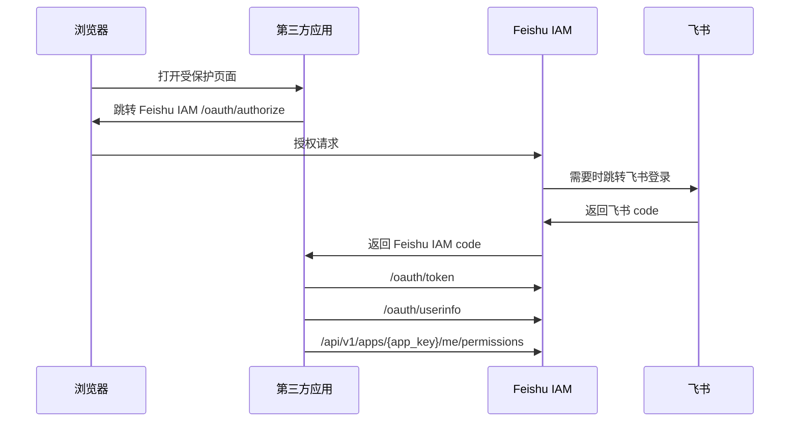

# Feishu IAM v0.4.0 SSO Provider Implementation Plan

> **For agentic workers:** REQUIRED SUB-SKILL: Use superpowers:subagent-driven-development (recommended) or superpowers:executing-plans to implement this plan task-by-task. Steps use checkbox (`- [ ]`) syntax for tracking.

**Goal:** 实现 Feishu IAM SSO Provider 最小可用闭环，让真实内部 Web 系统可以通过授权码流程登录、换取 Feishu IAM access token、读取用户信息并查询权限。

**Architecture:** 新增独立 `oauth` 后端模块承载授权码、token、Feishu OAuth 回调、应用侧鉴权和 SSO 错误页；在现有 `permission` 领域扩展应用环境、回调地址和 client 管理能力；复用 `v0.3.0` 的应用、权限计算和审计服务。管理端在应用详情中增加“接入配置”区域，文档提供人类和 Agent 可执行的接入步骤。

**Tech Stack:** NestJS、React + Vite、PostgreSQL、Prisma、Vitest、Supertest、Docker Compose。

---

## 文件结构

后端新增：

- `apps/api/src/oauth/oauth.module.ts`：OAuth 模块入口。
- `apps/api/src/oauth/oauth.controller.ts`：`/oauth/*` 端点和错误页。
- `apps/api/src/oauth/app-token.guard.ts`：应用侧 Bearer token 解析和校验。
- `apps/api/src/oauth/oauth.service.ts`：授权码、access token、userinfo、revoke 业务逻辑。
- `apps/api/src/oauth/oauth-config.service.ts`：环境、回调地址、client 管理服务。
- `apps/api/src/oauth/oauth-crypto.ts`：secret、code、token 生成、哈希和恒定时间比较。
- `apps/api/src/oauth/oauth.validators.ts`：redirect URI、scope、form 参数校验。
- `apps/api/src/oauth/oauth.types.ts`：领域类型和错误类。
- `apps/api/src/oauth/oauth-error.filter.ts`：稳定 JSON 错误和 SSO HTML 错误页。
- `apps/api/src/oauth/security-event.service.ts`：安全事件写入。
- `apps/api/src/feishu/feishu-oauth.types.ts`：飞书 OAuth 用户身份类型。

后端修改：

- `apps/api/prisma/schema.prisma`：新增 SSO 数据模型。
- `migrations/V0_4_0__sso_provider.sql`：新增 DDL。
- `apps/api/src/app.module.ts`：导入 `OauthModule`。
- `apps/api/src/feishu/feishu-client.ts`：扩展 OAuth 登录所需接口。
- `apps/api/src/feishu/feishu-http.client.ts`：实现飞书 OAuth code 换用户身份。
- `apps/api/src/feishu/mock-feishu.client.ts`：补齐测试用 OAuth 身份方法。
- `apps/api/src/permission/permission.module.ts`：导出 `AuditLogService`，供 OAuth 配置写操作复用。
- `apps/api/src/permission/permission.controller.ts`：挂载平台侧接入配置 API，或拆到 `oauth-config.controller.ts` 后在模块中注册。
- `apps/api/src/permission/permission.types.ts`：复用或扩展审计上下文类型。
- `package.json`、`apps/api/package.json`：版本从 `0.3.0` 提升为 `0.4.0`。

前端新增或修改：

- `apps/admin-web/src/api/oauth.ts`：接入配置 API client。
- `apps/admin-web/src/App.tsx`：在应用详情增加“接入配置”区域。
- `apps/admin-web/src/App.css`：补充接入配置表单、secret 展示和错误状态样式。
- `apps/admin-web/src/App.test.tsx`：覆盖接入配置渲染和 secret 一次性展示。

测试新增：

- `apps/api/test/oauth-crypto.spec.ts`
- `apps/api/test/oauth-config.service.spec.ts`
- `apps/api/test/oauth.controller.e2e-spec.ts`
- `apps/api/test/oauth.service.spec.ts`
- `apps/api/test/app-permissions.e2e-spec.ts`
- `apps/api/test/security-event.service.spec.ts`

文档新增或修改：

- `docs/sso-provider.md`
- `CHANGELOG.md`
- `README.md`
- `AGENTS.md`
- `docs/codex-sessions/YYYY-MM-DD-HHMM-v0.4.0-实施计划.md`

## Task 1: 数据库迁移与 Prisma 模型

**Files:**
- Create: `migrations/V0_4_0__sso_provider.sql`
- Modify: `apps/api/prisma/schema.prisma`
- Modify: `deploy/apply-migrations.sh`
- Test: `apps/api/test/prisma.service.spec.ts`

- [ ] **Step 1: 写入迁移 SQL**

Create `migrations/V0_4_0__sso_provider.sql` with these tables and indexes:

```sql
CREATE TABLE application_environments (
  id text PRIMARY KEY,
  application_id text NOT NULL REFERENCES applications(id) ON UPDATE CASCADE ON DELETE RESTRICT,
  environment_key text NOT NULL,
  name text NOT NULL,
  status text NOT NULL DEFAULT 'active',
  created_at timestamptz NOT NULL DEFAULT now(),
  updated_at timestamptz NOT NULL DEFAULT now(),
  CONSTRAINT application_environments_environment_key_check CHECK (environment_key IN ('dev', 'test', 'prod')),
  CONSTRAINT application_environments_status_check CHECK (status IN ('active', 'disabled')),
  CONSTRAINT application_environments_application_key_unique UNIQUE (application_id, environment_key),
  CONSTRAINT application_environments_id_application_unique UNIQUE (application_id, id)
);

CREATE TABLE application_redirect_uris (
  id text PRIMARY KEY,
  application_id text NOT NULL,
  environment_id text NOT NULL,
  redirect_uri text NOT NULL,
  status text NOT NULL DEFAULT 'active',
  created_at timestamptz NOT NULL DEFAULT now(),
  updated_at timestamptz NOT NULL DEFAULT now(),
  CONSTRAINT application_redirect_uris_status_check CHECK (status IN ('active', 'disabled')),
  CONSTRAINT application_redirect_uris_environment_fk FOREIGN KEY (application_id, environment_id)
    REFERENCES application_environments(application_id, id) ON UPDATE CASCADE ON DELETE RESTRICT,
  CONSTRAINT application_redirect_uris_environment_uri_unique UNIQUE (environment_id, redirect_uri)
);

CREATE TABLE application_clients (
  id text PRIMARY KEY,
  application_id text NOT NULL,
  environment_id text NOT NULL,
  client_id text NOT NULL UNIQUE,
  client_secret_hash text NOT NULL,
  name text NOT NULL,
  status text NOT NULL DEFAULT 'active',
  last_used_at timestamptz,
  created_at timestamptz NOT NULL DEFAULT now(),
  updated_at timestamptz NOT NULL DEFAULT now(),
  CONSTRAINT application_clients_status_check CHECK (status IN ('active', 'disabled')),
  CONSTRAINT application_clients_environment_fk FOREIGN KEY (application_id, environment_id)
    REFERENCES application_environments(application_id, id) ON UPDATE CASCADE ON DELETE RESTRICT,
  CONSTRAINT application_clients_environment_name_unique UNIQUE (environment_id, name)
);

CREATE TABLE oauth_login_states (
  id text PRIMARY KEY,
  state_hash text NOT NULL UNIQUE,
  client_id text NOT NULL REFERENCES application_clients(client_id) ON UPDATE CASCADE ON DELETE RESTRICT,
  redirect_uri text NOT NULL,
  requested_scope text NOT NULL,
  external_state text NOT NULL,
  expires_at timestamptz NOT NULL,
  consumed_at timestamptz,
  created_at timestamptz NOT NULL DEFAULT now()
);

CREATE TABLE oauth_authorization_codes (
  id text PRIMARY KEY,
  code_hash text NOT NULL UNIQUE,
  application_id text NOT NULL REFERENCES applications(id) ON UPDATE CASCADE ON DELETE RESTRICT,
  environment_id text NOT NULL REFERENCES application_environments(id) ON UPDATE CASCADE ON DELETE RESTRICT,
  client_id text NOT NULL REFERENCES application_clients(client_id) ON UPDATE CASCADE ON DELETE RESTRICT,
  redirect_uri text NOT NULL,
  feishu_user_id text NOT NULL REFERENCES feishu_users(user_id) ON UPDATE CASCADE ON DELETE RESTRICT,
  scope text NOT NULL,
  state text NOT NULL,
  expires_at timestamptz NOT NULL,
  used_at timestamptz,
  created_at timestamptz NOT NULL DEFAULT now()
);

CREATE TABLE oauth_access_tokens (
  id text PRIMARY KEY,
  token_hash text NOT NULL UNIQUE,
  application_id text NOT NULL REFERENCES applications(id) ON UPDATE CASCADE ON DELETE RESTRICT,
  environment_id text NOT NULL REFERENCES application_environments(id) ON UPDATE CASCADE ON DELETE RESTRICT,
  client_id text NOT NULL REFERENCES application_clients(client_id) ON UPDATE CASCADE ON DELETE RESTRICT,
  feishu_user_id text NOT NULL REFERENCES feishu_users(user_id) ON UPDATE CASCADE ON DELETE RESTRICT,
  scope text NOT NULL,
  expires_at timestamptz NOT NULL,
  revoked_at timestamptz,
  last_used_at timestamptz,
  created_at timestamptz NOT NULL DEFAULT now()
);

CREATE TABLE security_events (
  id text PRIMARY KEY,
  event_type text NOT NULL,
  application_id text REFERENCES applications(id) ON UPDATE CASCADE ON DELETE SET NULL,
  client_id text,
  feishu_user_id text,
  result text NOT NULL,
  reason_code text,
  summary text NOT NULL,
  ip text,
  user_agent text,
  request_id text,
  created_at timestamptz NOT NULL DEFAULT now(),
  CONSTRAINT security_events_result_check CHECK (result IN ('success', 'failed'))
);

CREATE INDEX application_environments_application_id_idx ON application_environments(application_id);
CREATE INDEX application_redirect_uris_environment_id_idx ON application_redirect_uris(environment_id);
CREATE INDEX application_redirect_uris_status_idx ON application_redirect_uris(status);
CREATE INDEX application_clients_environment_id_idx ON application_clients(environment_id);
CREATE INDEX application_clients_status_idx ON application_clients(status);
CREATE INDEX oauth_login_states_expires_at_idx ON oauth_login_states(expires_at);
CREATE INDEX oauth_authorization_codes_client_id_idx ON oauth_authorization_codes(client_id);
CREATE INDEX oauth_authorization_codes_expires_at_idx ON oauth_authorization_codes(expires_at);
CREATE INDEX oauth_access_tokens_client_id_idx ON oauth_access_tokens(client_id);
CREATE INDEX oauth_access_tokens_feishu_user_id_idx ON oauth_access_tokens(feishu_user_id);
CREATE INDEX oauth_access_tokens_expires_at_idx ON oauth_access_tokens(expires_at);
CREATE INDEX security_events_created_at_idx ON security_events(created_at DESC);
CREATE INDEX security_events_event_type_idx ON security_events(event_type);

INSERT INTO schema_versions(version, description)
VALUES ('0.4.0', 'SSO Provider 授权码最小闭环');
```

- [ ] **Step 2: 更新 Prisma schema**

Add Prisma models mirroring the SQL names. Use existing naming style from `Application`, including relations back to `Application`. Include at least these model names:

```prisma
model ApplicationEnvironment {
  id             String   @id
  applicationId  String   @map("application_id")
  environmentKey String   @map("environment_key")
  name           String
  status         String   @default("active")
  createdAt      DateTime @default(now()) @map("created_at") @db.Timestamptz(6)
  updatedAt      DateTime @default(now()) @updatedAt @map("updated_at") @db.Timestamptz(6)
  application    Application @relation(fields: [applicationId], references: [id], onDelete: Restrict, onUpdate: Cascade)
  redirectUris   ApplicationRedirectUri[]
  clients        ApplicationClient[]

  @@unique([applicationId, environmentKey])
  @@unique([applicationId, id])
  @@index([applicationId])
  @@map("application_environments")
}
```

Also add these Prisma models with explicit `@@map("<table_name>")` values matching the SQL tables: `ApplicationRedirectUri`, `ApplicationClient`, `OauthLoginState`, `OauthAuthorizationCode`, `OauthAccessToken`, and `SecurityEvent`.

- [ ] **Step 3: 确认 migration runner 包含新版本**

Run:

```bash
pnpm --filter @feishu-iam/api prisma:format
pnpm --filter @feishu-iam/api prisma:validate
```

Expected: both commands exit 0.

- [ ] **Step 4: Commit**

```bash
git add apps/api/prisma/schema.prisma migrations/V0_4_0__sso_provider.sql deploy/apply-migrations.sh apps/api/test/prisma.service.spec.ts
git commit -m "feat: add sso provider schema"
```

## Task 2: OAuth 领域类型、加密工具和安全事件

**Files:**
- Create: `apps/api/src/oauth/oauth.types.ts`
- Create: `apps/api/src/oauth/oauth-crypto.ts`
- Create: `apps/api/src/oauth/oauth.validators.ts`
- Create: `apps/api/src/oauth/oauth-error.filter.ts`
- Create: `apps/api/src/oauth/security-event.service.ts`
- Test: `apps/api/test/oauth-crypto.spec.ts`
- Test: `apps/api/test/security-event.service.spec.ts`

- [ ] **Step 1: 写 crypto 测试**

Create `apps/api/test/oauth-crypto.spec.ts`:

```ts
import { describe, expect, it } from 'vitest';
import { createOauthSecret, hashOauthSecret, timingSafeEqualHash } from '../src/oauth/oauth-crypto';

describe('OAuth crypto helpers', () => {
  it('generates prefixed secrets and verifies hashes without storing plaintext', () => {
    const secret = createOauthSecret('biat');
    const other = createOauthSecret('biat');
    const hash = hashOauthSecret(secret);

    expect(secret).toMatch(/^biat_[A-Za-z0-9_-]{32,}$/);
    expect(other).not.toBe(secret);
    expect(hash).not.toContain(secret);
    expect(timingSafeEqualHash(secret, hash)).toBe(true);
    expect(timingSafeEqualHash(`${secret}x`, hash)).toBe(false);
  });
});
```

- [ ] **Step 2: 实现 OAuth 类型和错误**

Create `apps/api/src/oauth/oauth.types.ts`:

```ts
export type OauthEntityStatus = 'active' | 'disabled';
export type OauthEnvironmentKey = 'dev' | 'test' | 'prod';
export type OauthResult = 'success' | 'failed';
export type OauthErrorHttpStatus = 400 | 401 | 403 | 404 | 409 | 422 | 500;

export type OauthAuditContext = {
  requestId: string;
  ip: string | null;
  userAgent: string | null;
};

export class OauthDomainError extends Error {
  readonly status: OauthErrorHttpStatus;

  constructor(
    readonly code: string,
    message: string,
    status: OauthErrorHttpStatus = 400
  ) {
    super(message);
    this.name = 'OauthDomainError';
    this.status = status;
  }
}
```

- [ ] **Step 3: 实现 crypto helpers**

Create `apps/api/src/oauth/oauth-crypto.ts`:

```ts
import { createHash, randomBytes, timingSafeEqual } from 'node:crypto';

export function createOauthSecret(prefix: 'biac' | 'biat' | 'bics' | 'bils'): string {
  return `${prefix}_${randomBytes(32).toString('base64url')}`;
}

export function hashOauthSecret(secret: string): string {
  return createHash('sha256').update(secret, 'utf8').digest('hex');
}

export function timingSafeEqualHash(secret: string, expectedHash: string): boolean {
  const actual = Buffer.from(hashOauthSecret(secret), 'hex');
  const expected = Buffer.from(expectedHash, 'hex');
  return actual.length === expected.length && timingSafeEqual(actual, expected);
}

export function redactSecret(value: string): string {
  if (value.length <= 12) {
    return '[redacted]';
  }
  return `${value.slice(0, 6)}[redacted]${value.slice(-4)}`;
}
```

- [ ] **Step 4: 实现 validators**

Create `apps/api/src/oauth/oauth.validators.ts` with exact checks:

```ts
import { OauthDomainError, type OauthEnvironmentKey } from './oauth.types';

export function assertEnvironmentKey(value: string): asserts value is OauthEnvironmentKey {
  if (!['dev', 'test', 'prod'].includes(value)) {
    throw new OauthDomainError('OAUTH_ENVIRONMENT_KEY_INVALID', '环境 key 必须是 dev、test 或 prod', 422);
  }
}

export function assertRedirectUri(environmentKey: OauthEnvironmentKey, redirectUri: string): void {
  let parsed: URL;
  try {
    parsed = new URL(redirectUri);
  } catch {
    throw new OauthDomainError('OAUTH_REDIRECT_URI_INVALID', '回调地址必须是完整 URL', 422);
  }

  const isLocalhost = ['localhost', '127.0.0.1', '[::1]'].includes(parsed.hostname);
  if (environmentKey === 'prod' && parsed.protocol !== 'https:') {
    throw new OauthDomainError('OAUTH_REDIRECT_URI_PROD_HTTPS_REQUIRED', 'prod 环境回调地址必须使用 HTTPS', 422);
  }
  if (environmentKey === 'dev' && parsed.protocol === 'http:' && isLocalhost) {
    return;
  }
  if (!['https:', 'http:'].includes(parsed.protocol)) {
    throw new OauthDomainError('OAUTH_REDIRECT_URI_INVALID', '回调地址只支持 HTTP 或 HTTPS', 422);
  }
}
```

- [ ] **Step 5: 实现 SecurityEventService**

Create `apps/api/src/oauth/security-event.service.ts`:

```ts
import { randomUUID } from 'node:crypto';
import { Injectable } from '@nestjs/common';
import { PrismaService } from '../prisma/prisma.service';
import type { OauthResult } from './oauth.types';

export type SecurityEventInput = {
  eventType: string;
  applicationId?: string | null;
  clientId?: string | null;
  feishuUserId?: string | null;
  result: OauthResult;
  reasonCode?: string | null;
  summary: string;
  ip?: string | null;
  userAgent?: string | null;
  requestId?: string | null;
};

@Injectable()
export class SecurityEventService {
  constructor(private readonly prisma: PrismaService) {}

  async record(input: SecurityEventInput): Promise<void> {
    await this.prisma.securityEvent.create({
      data: {
        id: randomUUID(),
        eventType: input.eventType,
        applicationId: input.applicationId ?? null,
        clientId: input.clientId ?? null,
        feishuUserId: input.feishuUserId ?? null,
        result: input.result,
        reasonCode: input.reasonCode ?? null,
        summary: input.summary,
        ip: input.ip ?? null,
        userAgent: input.userAgent ?? null,
        requestId: input.requestId ?? null
      }
    });
  }
}
```

- [ ] **Step 6: Run tests and commit**

Run:

```bash
pnpm --filter @feishu-iam/api test -- oauth-crypto.spec.ts security-event.service.spec.ts
```

Expected: tests pass.

Commit:

```bash
git add apps/api/src/oauth apps/api/test/oauth-crypto.spec.ts apps/api/test/security-event.service.spec.ts
git commit -m "feat: add oauth domain utilities"
```

## Task 3: 平台侧环境、回调地址和 client 管理

**Files:**
- Create: `apps/api/src/oauth/oauth-config.service.ts`
- Create: `apps/api/src/oauth/oauth-config.controller.ts`
- Create: `apps/api/test/oauth-config.service.spec.ts`
- Modify: `apps/api/src/oauth/oauth.module.ts`
- Modify: `apps/api/src/app.module.ts`
- Modify: `apps/api/src/permission/permission.module.ts`
- Test: `apps/api/test/oauth.controller.e2e-spec.ts`

- [ ] **Step 1: 写 service 测试**

Create `apps/api/test/oauth-config.service.spec.ts` covering:

```ts
it('creates a client with one-time plaintext secret and stores only hash', async () => {
  const result = await service.createClient('finance', 'env-dev', { name: '本地开发' }, auditContext);
  expect(result.clientSecret).toMatch(/^bics_/);
  expect(prisma.applicationClient.create).toHaveBeenCalledWith(expect.objectContaining({
    data: expect.objectContaining({
      clientSecretHash: expect.not.stringContaining(result.clientSecret)
    })
  }));
});

it('rejects wildcard redirect uris', async () => {
  await expect(service.createRedirectUri('finance', 'env-prod', { redirectUri: 'https://*.example.com/callback' }, auditContext))
    .rejects.toMatchObject({ code: 'OAUTH_REDIRECT_URI_INVALID' });
});
```

- [ ] **Step 2: 实现 OauthConfigService**

Create service with these public methods and audit every write:

```ts
async createEnvironment(appKey: string, input: { environmentKey: string; name: string }, context: OauthAuditContext): Promise<ApplicationEnvironment>
async listEnvironments(appKey: string): Promise<ApplicationEnvironment[]>
async setEnvironmentStatus(appKey: string, environmentId: string, status: OauthEntityStatus, context: OauthAuditContext): Promise<ApplicationEnvironment>
async createRedirectUri(appKey: string, environmentId: string, input: { redirectUri: string }, context: OauthAuditContext): Promise<ApplicationRedirectUri>
async listRedirectUris(appKey: string, environmentId: string): Promise<ApplicationRedirectUri[]>
async disableRedirectUri(appKey: string, redirectUriId: string, context: OauthAuditContext): Promise<ApplicationRedirectUri>
async createClient(appKey: string, environmentId: string, input: { name: string }, context: OauthAuditContext): Promise<ApplicationClient & { clientSecret: string }>
async listClients(appKey: string, environmentId: string): Promise<Array<Omit<ApplicationClient, 'clientSecretHash'>>>
async rotateClientSecret(appKey: string, clientId: string, context: OauthAuditContext): Promise<{ clientId: string; clientSecret: string }>
async setClientStatus(appKey: string, clientId: string, status: OauthEntityStatus, context: OauthAuditContext): Promise<Omit<ApplicationClient, 'clientSecretHash'>>
```

Use `ApplicationService.getApplicationByKey(appKey, tx)` to anchor application ownership. Use `AuditLogService.record(auditPayload, tx)` with `actorType='platform_token'`, `source='platform_api'`, `resourceType` values `application_environment`, `application_redirect_uri`, and `application_client`. Never place plaintext secret in `before` or `after`; audit `after` should contain `clientId`, `name`, `status`, and `secretShownOnce: true`.

- [ ] **Step 3: 实现 controller**

Create platform endpoints exactly matching the design:

```ts
@Controller('/api/v1/platform/applications/:appKey')
@UseGuards(PlatformTokenGuard)
@UseFilters(PermissionErrorFilter, OauthErrorFilter)
export class OauthConfigController {
  @Post('/environments')
  createEnvironment(@Param('appKey') appKey: string, @Body() body: { environmentKey: string; name: string }, @Req() request: Request) {
    return this.config.createEnvironment(appKey, body, readOauthAuditContext(request));
  }

  @Get('/environments')
  listEnvironments(@Param('appKey') appKey: string) {
    return this.config.listEnvironments(appKey).then((items) => ({ items }));
  }

  @Post('/environments/:environmentId/enable')
  enableEnvironment(@Param('appKey') appKey: string, @Param('environmentId') environmentId: string, @Req() request: Request) {
    return this.config.setEnvironmentStatus(appKey, environmentId, 'active', readOauthAuditContext(request));
  }

  @Post('/environments/:environmentId/disable')
  disableEnvironment(@Param('appKey') appKey: string, @Param('environmentId') environmentId: string, @Req() request: Request) {
    return this.config.setEnvironmentStatus(appKey, environmentId, 'disabled', readOauthAuditContext(request));
  }

  @Post('/environments/:environmentId/redirect-uris')
  createRedirectUri(@Param('appKey') appKey: string, @Param('environmentId') environmentId: string, @Body() body: { redirectUri: string }, @Req() request: Request) {
    return this.config.createRedirectUri(appKey, environmentId, body, readOauthAuditContext(request));
  }

  @Get('/environments/:environmentId/redirect-uris')
  listRedirectUris(@Param('appKey') appKey: string, @Param('environmentId') environmentId: string) {
    return this.config.listRedirectUris(appKey, environmentId).then((items) => ({ items }));
  }

  @Post('/redirect-uris/:redirectUriId/disable')
  disableRedirectUri(@Param('appKey') appKey: string, @Param('redirectUriId') redirectUriId: string, @Req() request: Request) {
    return this.config.disableRedirectUri(appKey, redirectUriId, readOauthAuditContext(request));
  }

  @Post('/environments/:environmentId/clients')
  createClient(@Param('appKey') appKey: string, @Param('environmentId') environmentId: string, @Body() body: { name: string }, @Req() request: Request) {
    return this.config.createClient(appKey, environmentId, body, readOauthAuditContext(request));
  }

  @Get('/environments/:environmentId/clients')
  listClients(@Param('appKey') appKey: string, @Param('environmentId') environmentId: string) {
    return this.config.listClients(appKey, environmentId).then((items) => ({ items }));
  }

  @Post('/clients/:clientId/rotate-secret')
  rotateClientSecret(@Param('appKey') appKey: string, @Param('clientId') clientId: string, @Req() request: Request) {
    return this.config.rotateClientSecret(appKey, clientId, readOauthAuditContext(request));
  }

  @Post('/clients/:clientId/enable')
  enableClient(@Param('appKey') appKey: string, @Param('clientId') clientId: string, @Req() request: Request) {
    return this.config.setClientStatus(appKey, clientId, 'active', readOauthAuditContext(request));
  }

  @Post('/clients/:clientId/disable')
  disableClient(@Param('appKey') appKey: string, @Param('clientId') clientId: string, @Req() request: Request) {
    return this.config.setClientStatus(appKey, clientId, 'disabled', readOauthAuditContext(request));
  }
}
```

- [ ] **Step 4: Run tests and commit**

Run:

```bash
pnpm --filter @feishu-iam/api test -- oauth-config.service.spec.ts oauth.controller.e2e-spec.ts
```

Expected: platform config API tests pass.

Commit:

```bash
git add apps/api/src/oauth apps/api/src/app.module.ts apps/api/src/permission/permission.module.ts apps/api/test/oauth-config.service.spec.ts apps/api/test/oauth.controller.e2e-spec.ts
git commit -m "feat: add sso client configuration api"
```

## Task 4: Feishu OAuth 回调和授权码发放

**Files:**
- Create: `apps/api/src/oauth/oauth.module.ts`
- Create: `apps/api/src/oauth/oauth.controller.ts`
- Create: `apps/api/src/oauth/oauth.service.ts`
- Create: `apps/api/src/feishu/feishu-oauth.types.ts`
- Modify: `apps/api/src/feishu/feishu-client.ts`
- Modify: `apps/api/src/feishu/feishu-http.client.ts`
- Modify: `apps/api/src/feishu/mock-feishu.client.ts`
- Test: `apps/api/test/oauth.service.spec.ts`
- Test: `apps/api/test/oauth.controller.e2e-spec.ts`

- [ ] **Step 1: 扩展 FeishuClient contract**

Add to `FeishuClient`:

```ts
exchangeOAuthCode(code: string): Promise<FeishuOAuthUserIdentity>;
buildOAuthAuthorizeUrl(params: { state: string; redirectUri: string }): string;
```

Create `apps/api/src/feishu/feishu-oauth.types.ts`:

```ts
export type FeishuOAuthUserIdentity = {
  user_id: string;
  open_id?: string;
  union_id?: string;
  name?: string;
  avatar_url?: string;
};
```

- [ ] **Step 2: 写授权测试**

Add tests:

```ts
it('redirects authorize requests to Feishu after validating client and redirect uri', async () => {
  const response = await request(httpServer)
    .get('/oauth/authorize')
    .query({
      response_type: 'code',
      client_id: 'client-dev',
      redirect_uri: 'http://localhost:5179/callback',
      state: 'state-123'
    })
    .expect(302);

  expect(response.headers.location).toContain('open.feishu.cn');
});

it('renders the SSO error page when redirect uri is not trusted', async () => {
  const response = await request(httpServer)
    .get('/oauth/authorize')
    .query({
      response_type: 'code',
      client_id: 'client-dev',
      redirect_uri: 'https://evil.example/callback',
      state: 'state-123'
    })
    .expect(400);

  expect(response.text).toContain('无法完成登录');
  expect(response.text).not.toContain('client_secret');
});
```

- [ ] **Step 3: 实现 authorize 和 Feishu callback**

In `OauthService` implement:

```ts
async startAuthorization(input: AuthorizeInput, context: OauthAuditContext): Promise<{ redirectTo: string }>
async handleFeishuCallback(input: { code: string; state: string }, context: OauthAuditContext): Promise<{ redirectTo: string }>
```

Rules:

- Validate `response_type=code`, `state`, client status, application status, environment status, and exact `redirect_uri`.
- Store internal login state in `oauth_login_states` using `bils_` state secret hash.
- Build Feishu authorize URL using configured `FEISHU_OAUTH_REDIRECT_URI`.
- On callback, consume login state once, exchange Feishu code, load `feishu_users` by `user_id`, reject inactive or deleted users, create `biac_` authorization code, store only code hash, redirect to third-party URL built with `new URL(redirectUri)` and `searchParams.set('code', code)` plus `searchParams.set('state', externalState)`.
- Record security event for login success and failure.

- [ ] **Step 4: 实现统一错误页**

`OauthErrorFilter` must return JSON for `/oauth/token`, `/oauth/userinfo`, `/oauth/revoke`, and `/api/v1/apps/*`; for browser authorize failures it renders:

```html
<!doctype html>
<html lang="zh-CN">
  <head><meta charset="utf-8"><title>无法完成登录</title></head>
  <body>
    <main>
      <h1>无法完成登录</h1>
      <p>{{safeMessage}}</p>
      <p>request id: {{requestId}}</p>
    </main>
  </body>
</html>
```

Use HTML escaping for `safeMessage` and `requestId`.

- [ ] **Step 5: Run tests and commit**

Run:

```bash
pnpm --filter @feishu-iam/api test -- oauth.service.spec.ts oauth.controller.e2e-spec.ts
```

Expected: authorize and callback tests pass.

Commit:

```bash
git add apps/api/src/oauth apps/api/src/feishu apps/api/test/oauth.service.spec.ts apps/api/test/oauth.controller.e2e-spec.ts
git commit -m "feat: add oauth authorize flow"
```

## Task 5: Token 换取、撤销和 userinfo

**Files:**
- Modify: `apps/api/src/oauth/oauth.service.ts`
- Modify: `apps/api/src/oauth/oauth.controller.ts`
- Create: `apps/api/src/oauth/app-token.guard.ts`
- Test: `apps/api/test/oauth.service.spec.ts`
- Test: `apps/api/test/oauth.controller.e2e-spec.ts`

- [ ] **Step 1: 写 token 测试**

Add service and e2e tests:

```ts
it('exchanges an unused code for a bearer token and marks the code as used', async () => {
  const result = await service.exchangeCode({
    grantType: 'authorization_code',
    code: 'biac_valid',
    redirectUri: 'http://localhost:5179/callback',
    clientId: 'client-dev',
    clientSecret: 'bics_valid'
  }, auditContext);

  expect(result.access_token).toMatch(/^biat_/);
  expect(result.token_type).toBe('Bearer');
  expect(result.expires_in).toBe(7200);
});

it('rejects a reused authorization code', async () => {
  await expect(service.exchangeCode(reusedCodeInput, auditContext))
    .rejects.toMatchObject({ code: 'OAUTH_CODE_USED' });
});
```

- [ ] **Step 2: 实现 token exchange**

Implement:

```ts
async exchangeCode(input: TokenInput, context: OauthAuditContext): Promise<TokenResponse>
```

Use a transaction to:

- Find client by `client_id`.
- Validate client secret with `timingSafeEqualHash`.
- Find code by hash.
- Check code belongs to same client, same redirect URI, not expired, and `used_at` is null.
- Update `used_at`.
- Create `oauth_access_tokens` with `biat_` plaintext returned once and SHA-256 hash stored.
- Update `application_clients.last_used_at`.

- [ ] **Step 3: 实现 Bearer token guard**

Create `AppTokenGuard` that attaches this request context:

```ts
export type AppTokenContext = {
  applicationId: string;
  appKey: string;
  environmentId: string;
  clientId: string;
  feishuUserId: string;
  scope: string;
};
```

Reject missing, expired, revoked, disabled application, disabled environment, disabled client, and inactive/deleted user with stable OAuth error codes.

- [ ] **Step 4: 实现 userinfo 和 revoke**

Controller endpoints:

```ts
@Post('/oauth/token')
token(@Body() body: TokenFormBody, @Req() request: Request): Promise<TokenResponse>

@Get('/oauth/userinfo')
userinfo(@Req() request: Request): Promise<UserinfoResponse>

@Post('/oauth/revoke')
revoke(@Body() body: RevokeFormBody, @Req() request: Request): Promise<{ revoked: true }>
```

`userinfo` returns `sub`, `user_id`, `open_id`, `union_id`, `name`, `avatar`, `email`, `employee_no`, and `job_title`. Do not return `mobile`.

`revoke` validates client credentials, hashes incoming token, sets `revoked_at` when token belongs to the client, and returns `{ "revoked": true }` even when token is unknown.

- [ ] **Step 5: Run tests and commit**

Run:

```bash
pnpm --filter @feishu-iam/api test -- oauth.service.spec.ts oauth.controller.e2e-spec.ts
```

Expected: token, userinfo, and revoke tests pass.

Commit:

```bash
git add apps/api/src/oauth apps/api/test/oauth.service.spec.ts apps/api/test/oauth.controller.e2e-spec.ts
git commit -m "feat: add oauth token endpoints"
```

## Task 6: 应用侧权限查询接口

**Files:**
- Create: `apps/api/src/oauth/app-permissions.controller.ts`
- Modify: `apps/api/src/oauth/oauth.module.ts`
- Modify: `apps/api/src/permission/permission.module.ts`
- Test: `apps/api/test/app-permissions.e2e-spec.ts`

- [ ] **Step 1: 写应用侧权限接口测试**

Create tests:

```ts
it('returns permissions for the token user when app_key matches token application', async () => {
  calculationService.calculate.mockResolvedValue({
    app_key: 'finance',
    user_id: 'ou-user',
    permission_groups: [{ key: 'finance.invoice_manager', name: '发票管理员' }],
    permission_points: [{ key: 'finance.invoice.read', name: '查看发票' }],
    matched_roles: [{ key: 'invoice_manager', name: '发票管理员' }],
    computed_at: '2026-05-16T00:00:00.000Z'
  });

  await request(httpServer)
    .get('/api/v1/apps/finance/me/permissions')
    .set('Authorization', 'Bearer biat_valid')
    .expect(200)
    .expect((response) => {
      expect(response.body.app_key).toBe('finance');
      expect(response.body.user_id).toBe('ou-user');
    });
});

it('rejects cross-application token usage', async () => {
  await request(httpServer)
    .get('/api/v1/apps/crm/me/permissions')
    .set('Authorization', 'Bearer biat_finance')
    .expect(403)
    .expect((response) => {
      expect(response.body.error.code).toBe('OAUTH_APP_KEY_MISMATCH');
    });
});
```

- [ ] **Step 2: 实现 controller**

Create:

```ts
@Controller('/api/v1/apps/:appKey/me')
@UseGuards(AppTokenGuard)
@UseFilters(OauthErrorFilter, PermissionErrorFilter)
export class AppPermissionsController {
  constructor(private readonly permissions: PermissionCalculationService) {}

  @Get('/permissions')
  async getPermissions(@Param('appKey') appKey: string, @Req() request: Request): Promise<PermissionPreviewResponse> {
    const token = readAppTokenContext(request);
    if (token.appKey !== appKey) {
      throw new OauthDomainError('OAUTH_APP_KEY_MISMATCH', 'token 所属应用与路径应用不一致', 403);
    }
    return this.permissions.calculate(appKey, token.feishuUserId);
  }
}
```

- [ ] **Step 3: Run tests and commit**

Run:

```bash
pnpm --filter @feishu-iam/api test -- app-permissions.e2e-spec.ts
```

Expected: app permission API tests pass.

Commit:

```bash
git add apps/api/src/oauth/app-permissions.controller.ts apps/api/src/oauth/oauth.module.ts apps/api/src/permission/permission.module.ts apps/api/test/app-permissions.e2e-spec.ts
git commit -m "feat: add app permission endpoint"
```

## Task 7: 管理端接入配置页

**Files:**
- Create: `apps/admin-web/src/api/oauth.ts`
- Modify: `apps/admin-web/src/App.tsx`
- Modify: `apps/admin-web/src/App.css`
- Modify: `apps/admin-web/src/App.test.tsx`

- [ ] **Step 1: 写前端 API client**

Create `apps/admin-web/src/api/oauth.ts` with types:

```ts
export type ApplicationEnvironment = {
  id: string;
  applicationId: string;
  environmentKey: 'dev' | 'test' | 'prod';
  name: string;
  status: 'active' | 'disabled';
};

export type ApplicationRedirectUri = {
  id: string;
  environmentId: string;
  redirectUri: string;
  status: 'active' | 'disabled';
};

export type ApplicationClient = {
  id: string;
  environmentId: string;
  clientId: string;
  name: string;
  status: 'active' | 'disabled';
  lastUsedAt?: string | null;
};

export type CreatedApplicationClient = ApplicationClient & {
  clientSecret: string;
};
```

Implement these fetch functions using the same platform token header pattern as `apps/admin-web/src/api/permission.ts`:

```ts
export async function fetchApplicationEnvironments(appKey: string): Promise<ApplicationEnvironment[]>
export async function createApplicationEnvironment(appKey: string, input: { environmentKey: 'dev' | 'test' | 'prod'; name: string }): Promise<ApplicationEnvironment>
export async function fetchRedirectUris(appKey: string, environmentId: string): Promise<ApplicationRedirectUri[]>
export async function createRedirectUri(appKey: string, environmentId: string, input: { redirectUri: string }): Promise<ApplicationRedirectUri>
export async function fetchApplicationClients(appKey: string, environmentId: string): Promise<ApplicationClient[]>
export async function createApplicationClient(appKey: string, environmentId: string, input: { name: string }): Promise<CreatedApplicationClient>
export async function rotateApplicationClientSecret(appKey: string, clientId: string): Promise<{ clientId: string; clientSecret: string }>
export async function disableApplicationClient(appKey: string, clientId: string): Promise<ApplicationClient>
```

- [ ] **Step 2: 增加 App 测试**

Add tests that mock `/api/v1/platform/applications/finance/environments` and assert:

```ts
expect(screen.getByText('接入配置')).toBeInTheDocument();
expect(screen.getByText('dev')).toBeInTheDocument();
expect(screen.queryByText(/bics_/)).not.toBeInTheDocument();
```

For create client success:

```ts
expect(await screen.findByText('请立即保存 client secret')).toBeInTheDocument();
expect(screen.getByText(/^bics_/)).toBeInTheDocument();
```

- [ ] **Step 3: 实现 UI**

In selected application detail add a fourth section named `接入配置` with:

- Environment list: key, name, status.
- Redirect URI list grouped by environment.
- Client list grouped by environment.
- Create redirect URI form with environment select and redirect URI input.
- Create client form with environment select and name input.
- Rotate secret button with confirmation.
- Disable client button with confirmation.
- One-time secret callout using a monospace block and warning text `请立即保存 client secret，关闭后无法再次查看。`

- [ ] **Step 4: Run tests and commit**

Run:

```bash
pnpm --filter @feishu-iam/admin-web test
pnpm --filter @feishu-iam/admin-web typecheck
pnpm --filter @feishu-iam/admin-web lint
```

Expected: all admin web checks pass.

Commit:

```bash
git add apps/admin-web/src/api/oauth.ts apps/admin-web/src/App.tsx apps/admin-web/src/App.css apps/admin-web/src/App.test.tsx
git commit -m "feat: add sso client admin panel"
```

## Task 8: 文档、版本和发布验收

**Files:**
- Create: `docs/sso-provider.md`
- Create: `docs/codex-sessions/YYYY-MM-DD-HHMM-v0.4.0-sso-provider.md`
- Modify: `README.md`
- Modify: `CHANGELOG.md`
- Modify: `AGENTS.md`
- Modify: `package.json`
- Modify: `apps/api/package.json`
- Modify: `apps/admin-web/package.json`

- [ ] **Step 1: 写 SSO 接入文档**

Create `docs/sso-provider.md` with sections:

````md
# Feishu IAM SSO Provider 接入指南

## 适用范围

本文档适用于接入 Feishu IAM `v0.4.0` 授权码最小闭环的内部 Web 系统。

## 接入流程


````

Also include curl examples for authorize URL construction, token exchange, userinfo, permissions, revoke, error table, and Agent checklist.

- [ ] **Step 2: 更新版本和入口文档**

Update:

- `package.json` version to `0.4.0`.
- `apps/api/package.json` version to `0.4.0`.
- `apps/admin-web/package.json` version to `0.4.0`.
- `README.md` current state to include `v0.4.0` after implementation.
- `CHANGELOG.md` with `v0.4.0` section.
- `AGENTS.md` current stage to say `v0.4.0` implementation/release status.

- [ ] **Step 3: 归档会话**

Create `docs/codex-sessions/YYYY-MM-DD-HHMM-v0.4.0-sso-provider.md` with:

- 会话目标。
- 用户原始关键要求摘要。
- 关键提示词和约束。
- 重要设计和实施决策。
- 修改过的文件。
- 执行过的关键命令和验证结果。
- 未完成事项和下一步建议。

- [ ] **Step 4: 全量验证**

Run:

```bash
pnpm check
pnpm --filter @feishu-iam/api prisma:validate
docker compose -f deploy/docker-compose.yml config --quiet
```

Expected: all commands exit 0.

- [ ] **Step 5: Manual acceptance**

Run local API and admin web, then verify manually:

1. Create application `finance`.
2. Create `dev` environment.
3. Register `http://localhost:5179/callback`.
4. Create client and save one-time `client_secret`.
5. Open `/oauth/authorize?response_type=code&client_id=<client_id>&redirect_uri=http%3A%2F%2Flocalhost%3A5179%2Fcallback&state=manual-state`.
6. Complete Feishu login or use mock Feishu client in test mode.
7. Exchange code with `/oauth/token`.
8. Call `/oauth/userinfo`.
9. Call `/api/v1/apps/finance/me/permissions`.
10. Revoke token and confirm userinfo and permissions are rejected.

- [ ] **Step 6: Commit**

```bash
git add docs/sso-provider.md docs/codex-sessions README.md CHANGELOG.md AGENTS.md package.json apps/api/package.json apps/admin-web/package.json
git commit -m "docs: document v0.4.0 sso provider"
```

## Final Review Checklist

- [ ] `docs/superpowers/specs/2026-05-16-feishu-iam-v0.4.0-sso-provider-design.md` has a corresponding task for every included feature.
- [ ] No plaintext `client_secret`, authorization code, access token, cookie, password, or Feishu secret appears in logs, audit rows, docs examples, or session archives.
- [ ] All OAuth errors use stable error codes.
- [ ] Browser-facing login failures render the Feishu IAM error page.
- [ ] App-facing failures return JSON.
- [ ] `redirect_uri` matching is exact.
- [ ] Authorization codes are one-time use.
- [ ] Access tokens are opaque and server-side.
- [ ] Permission query calls the existing `PermissionCalculationService`.
- [ ] `pnpm check` passes.
- [ ] `prisma:validate` passes.
- [ ] Docker Compose config validation passes.
