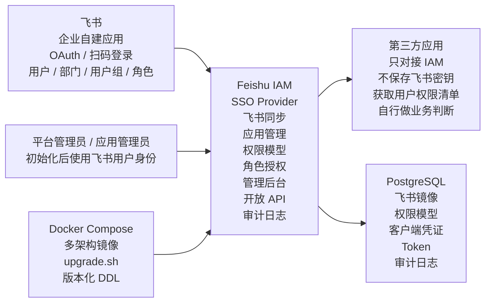
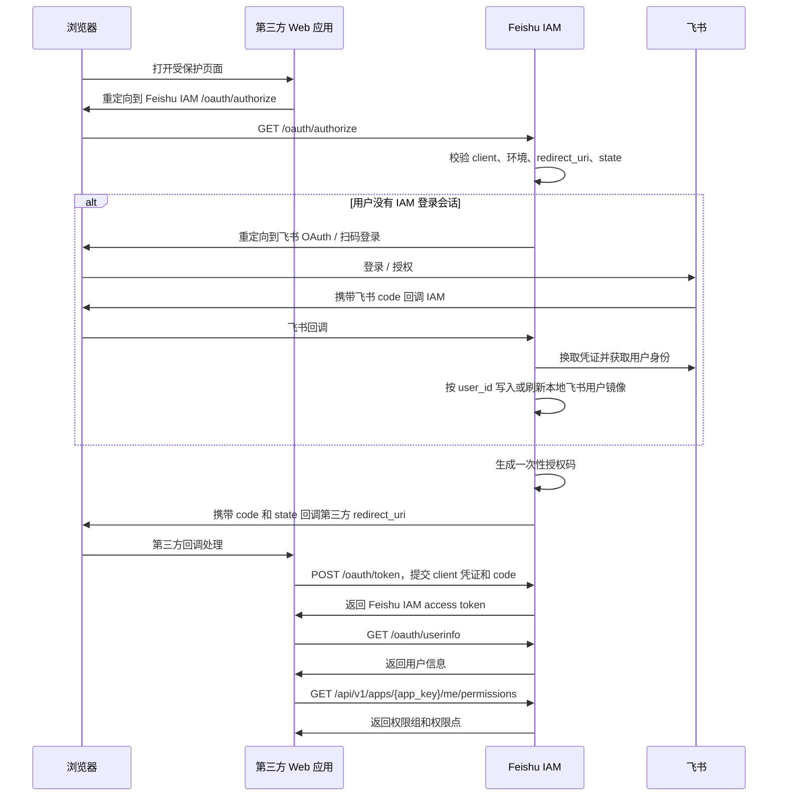

# Feishu IAM 设计方案

日期：2026-05-15
状态：已确认，可进入实施计划阶段

## 1. 项目目标

Feishu IAM 是企业内部使用的身份与权限管理中台，核心职责包括：

- 基于飞书完成统一登录和组织身份管理。
- 管理第三方应用接入。
- 为每个第三方应用维护权限组和权限点。
- 通过 IAM 角色把飞书用户、部门、用户组、飞书角色映射到应用权限。
- 为第三方系统提供 SSO 接入能力和 AI 友好的接入文档。
- 提供 Web 和 API 管理能力，并记录可审计的配置变更日志。
- 支持 Docker Compose 部署和版本化升级。

第一版采用“平台均衡型”方案：每个核心能力都形成最小可用闭环，但不进入资源级权限、deny 规则、多租户 SaaS 化和完整 OIDC 协议实现。

## 2. 第一版成功标准

第一版成功的标准是：一个真实内部 Web 系统可以完成完整接入。

具体包括：

1. 在 Feishu IAM 创建第三方应用。
2. 配置 dev、test、prod 环境回调地址和客户端凭证。
3. 第三方系统把用户重定向到 Feishu IAM 登录。
4. Feishu IAM 通过飞书完成用户身份确认。
5. 第三方系统用授权码换取 Feishu IAM token。
6. 第三方系统获取用户信息和权限组/权限点清单。
7. 第三方系统根据权限控制菜单、按钮和后端接口。
8. 管理员在 Feishu IAM 调整角色授权，并能在审计日志中追溯变更。

## 3. 核心原则

- 飞书是用户身份和组织主数据的唯一来源。
- Feishu IAM 是企业内部第三方系统统一的 SSO Provider。
- 第三方应用不绑定自己的飞书应用凭证。
- Feishu IAM 只配置一个企业级飞书自建应用，用于登录和主数据同步。
- 第三方系统只对接 Feishu IAM。
- Feishu IAM 只返回权限组和权限点，第三方系统自行完成业务判断。
- 权限数据按应用隔离。
- 所有 Web/API 写操作必须审计。
- 项目所有文档使用中文，并且要同时方便人类和 AI Agent 阅读。

## 4. 整体架构



职责边界：

- 飞书负责证明用户是谁，并提供组织主数据。
- Feishu IAM 负责登录代理、应用注册、权限映射、管理 API、Web 管理和审计追踪。
- 第三方应用负责把权限组和权限点映射到自己的菜单、按钮、后端路由和业务行为。

## 5. 飞书登录架构

Feishu IAM 使用一个企业级飞书自建应用。该应用在 Feishu IAM 中配置一次 `app_id` 和 `app_secret`。第三方应用永远不接收、不保存飞书凭证。

登录流程：



Feishu IAM 第一版提供 OIDC 兼容的授权码流程子集，不实现完整 OIDC 协议。

必须提供的 SSO 端点：

- `GET /oauth/authorize`
- `POST /oauth/token`
- `GET /oauth/userinfo`
- `POST /oauth/revoke`
- `GET /api/v1/apps/{app_key}/me/permissions`

Token 策略：

- 授权码短有效期，例如 5 分钟，并且只能使用一次。
- 第一版 access token 使用服务端不透明 token，便于撤销，也避免把过期权限塞进 token。
- refresh token 支持应用级开关。
- 权限变化后，第三方应用通过重新获取权限清单感知变化。权限不作为 access token 内的可信源。

SSO 失败时必须渲染 Feishu IAM 统一错误页，不能显示框架默认错误或裸 JSON。错误页必须包含：

- 清晰标题，例如“无法完成登录”。
- 用户可理解的失败原因。
- 用于审计排查的 request id。
- 在安全情况下提供返回第三方应用或重新登录按钮。
- 管理员排查提示，但不能泄露密钥、token 或堆栈信息。

## 6. 飞书主数据同步

Feishu IAM 只镜像飞书数据，不在本地创建独立业务用户。

同步范围：

- 用户。
- 部门。
- 用户组，包括普通用户组和动态用户组的查询镜像。
- 飞书角色。
- 用户状态。
- 展示字段，例如邮箱、手机号、头像、工号、职务、员工类型、自定义字段等。

同步模型必须尽量对齐飞书 OpenAPI 字段名。重要用户字段包括：

- `user_id`
- `open_id`
- `union_id`
- `name`
- `en_name`
- `email`
- `mobile`
- `mobile_visible`
- `gender`
- `avatar_key`
- `department_ids`
- `leader_user_id`
- `city`
- `country`
- `work_station`
- `join_time`
- `employee_no`
- `employee_type`
- `orders`
- `custom_attrs`
- `enterprise_email`
- `job_title`
- `status`

重要部门字段包括：

- `department_id`
- `open_department_id`
- `name`
- `i18n_name`
- `parent_department_id`
- `leader_user_id`
- `order`
- `unit_ids`

重要用户组字段包括：

- `group_id`
- `name`
- `description`
- `type`

重要飞书角色字段包括：

- `role_id`
- `name`
- 角色成员和成员管理范围。

身份主键策略：

- 为了可读性和内部业务引用，Feishu IAM 优先使用飞书 `user_id` 作为用户业务主键。
- `open_id` 和 `union_id` 仍然必须保存，并在适合的范围内建立唯一索引。
- 如果飞书 `user_id` 发生变化，按身份迁移事件处理，不能静默创建新用户。
- 镜像表保留 `raw_payload jsonb` 保存飞书原始响应，便于后续字段补齐和排错。

同步方式：

- 支持管理后台和平台 API 手动触发同步。
- 支持定时同步，可配置固定周期或 cron 表达式，例如每 6 小时。
- 第一版使用全量或分页同步，飞书事件订阅作为后续增量优化。
- 同步按飞书 ID 幂等 upsert。

同步日志必须记录：

- 开始时间和结束时间。
- 触发来源。
- 同步对象类型。
- 新增、更新、禁用、失败数量。
- 错误摘要。
- request id 或 run id。

身份治理规则：

- 禁用、离职、主动退出或未激活的飞书用户不可登录。
- 已有 token 对应用户变为禁用状态后，后续权限查询必须失败或返回空权限结果。
- IAM 角色成员可以引用飞书用户、部门、用户组或飞书角色。
- 飞书部门、用户组或角色被删除后，相关绑定标记为 orphaned，不立即硬删除。

部署文档必须提供飞书权限 checklist。如果可选敏感字段未授权，系统仍可运行，但需要提示后台展示字段不完整。

## 7. 核心数据模型

推荐按以下表组设计。

### 7.1 飞书镜像

- `feishu_users`
- `feishu_departments`
- `feishu_user_groups`
- `feishu_user_group_members`
- `feishu_roles`
- `feishu_role_members`
- `feishu_sync_runs`

这些表保留飞书字段名，并增加本地元数据，例如 `created_at`、`updated_at`、`last_synced_at`、`deleted_at`、`sync_status`、`raw_payload`。

### 7.2 管理员

- `admin_users`
- `admin_roles`
- `admin_role_bindings`
- `admin_application_scopes`

配置超级管理员通过环境变量设置，用于初始化和紧急破窗。日常管理员必须是飞书用户。

### 7.3 应用与客户端

- `applications`
- `application_environments`
- `application_clients`

应用拥有全局唯一 `app_key`。环境用于隔离回调地址、允许域名和 client 凭证。权限模型在同一应用内跨环境共享。

### 7.4 权限模型

- `permission_groups`
- `permission_points`
- `permission_group_points`

权限组和权限点属于单个应用。权限点必须使用应用 key 作为前缀。

### 7.5 IAM 角色与绑定

- `iam_roles`
- `iam_role_subjects`
- `iam_role_permission_groups`
- `iam_role_permission_points`

IAM 角色把飞书主体映射到权限组和权限点。第一版聚焦应用角色，全局角色主要用于平台管理。

### 7.6 OAuth 与会话

- `auth_sessions`
- `authorization_codes`
- `access_tokens`
- `refresh_tokens`

### 7.7 审计与安全日志

- `audit_logs`
- `security_events`

审计日志记录 Web/API 写操作。安全事件记录登录失败和高风险事件。

## 8. 权限模型与权限计算

每个应用拥有全局唯一 `app_key`，例如 `finance`、`oa`、`crm`。

权限点 key 规则：

- 权限点 key 必须以 `${app_key}.` 开头。
- 后续层级由第三方应用自行定义。
- 管理后台提交和 API 提交必须使用同一套后端校验逻辑。
- 权限点不能使用其他应用前缀。
- 权限点不能省略应用前缀。

推荐校验规则：

```text
^${app_key}\.[a-z0-9][a-z0-9._-]{0,127}$
```

示例：

- `finance` 应用下合法：`finance.invoice.read`
- `finance` 应用下合法：`finance.invoice.approve`
- `finance` 应用下非法：`invoice.read`
- `finance` 应用下非法：`crm.customer.read`

权限计算规则：

- 输入包括：`app_key`、飞书 `user_id`、用户状态、部门、用户组、飞书角色、应用状态、IAM 角色、权限组和权限点。
- IAM 角色可以绑定权限组，也可以额外绑定权限点。
- 权限组展开为权限点。
- 用户命中多个角色时，权限组和权限点取并集。
- 禁用的权限组和权限点不进入计算结果。
- 第一版不做 deny 规则、资源条件、数据范围或 ABAC 表达式。
- 禁止跨应用绑定。

示例响应：

```json
{
  "app_key": "finance",
  "user_id": "u273y71",
  "permission_groups": [
    {
      "key": "finance.invoice_manager",
      "name": "发票管理员"
    }
  ],
  "permission_points": [
    {
      "key": "finance.invoice.read",
      "name": "查看发票"
    },
    {
      "key": "finance.invoice.approve",
      "name": "审批发票"
    }
  ],
  "computed_at": "2026-05-15T10:00:00Z"
}
```

缓存策略：

- 第一版使用短 TTL 缓存，默认 1 分钟，最高可配置到 5 分钟。
- Web/API 修改角色、绑定、权限组或权限点后，必须清理相关应用缓存。
- 飞书同步发现用户状态或成员关系变化后，必须清理相关用户缓存。

## 9. 管理后台与管理员体系

管理后台使用 Feishu IAM 自己的后台入口，不使用第三方应用 SSO client。

管理员类型：

- 配置超级管理员：通过 Docker Compose 环境变量配置，例如 `BOOTSTRAP_SUPER_ADMIN_USERNAME`、`BOOTSTRAP_SUPER_ADMIN_PASSWORD_HASH`。
- 平台管理员：管理全局配置、应用、角色、同步和管理员。
- 应用管理员：管理被授权应用的权限模型、client、回调地址和角色绑定。
- 审计查看员：查看审计日志和同步日志。
- 同步管理员：触发同步并查看同步结果。

配置超级管理员首次登录后，必须绑定至少一个飞书用户为平台管理员。日常管理必须通过飞书用户身份完成。配置超级管理员保留为紧急破窗入口，每次使用都必须写入高风险审计日志。

核心后台页面：

- 概览：应用数、用户数、最近同步状态、失败任务、高风险变更。
- 飞书同步：飞书应用配置、权限 checklist、手动同步、同步计划、同步日志。
- 应用管理：`app_key`、负责人、状态、环境、回调地址、client。
- 权限管理：权限组和权限点，包含严格 key 校验。
- 角色授权：IAM 角色、飞书主体选择、权限绑定。
- 管理员管理：把飞书用户绑定为后台管理员。
- 审计日志：按操作者、资源、应用、来源、时间和结果筛选。
- 接入文档：按应用生成快速开始、client 配置、回调配置、流程图、端点、示例和 OpenAPI 链接。

体验规则：

- 写操作需要清晰确认或提交后反馈。
- client secret 只在创建或轮换时显示一次。
- `app_key`、权限点 key、回调地址在前端和后端都要校验。
- 表单错误必须具体，不能只显示“保存失败”。
- 飞书敏感字段只有在已同步且管理员有权限时才展示。

## 10. 开放 API

开放 API 分为两类凭证和两条边界。

### 10.1 应用侧 API

应用侧 API 使用应用 client 或应用 access token，只能操作自己的应用。

必备能力：

- 创建、查询、更新、禁用权限组。
- 创建、查询、更新、禁用权限点。
- 查询当前用户在本应用下的权限。
- 查询 OAuth 用户信息。

代表端点：

- `POST /api/v1/apps/{app_key}/permission-groups`
- `GET /api/v1/apps/{app_key}/permission-groups`
- `PATCH /api/v1/apps/{app_key}/permission-groups/{id}`
- `DELETE /api/v1/apps/{app_key}/permission-groups/{id}`
- `POST /api/v1/apps/{app_key}/permission-points`
- `GET /api/v1/apps/{app_key}/permission-points`
- `PATCH /api/v1/apps/{app_key}/permission-points/{id}`
- `DELETE /api/v1/apps/{app_key}/permission-points/{id}`
- `GET /api/v1/apps/{app_key}/me/permissions`
- `GET /oauth/userinfo`

应用侧 API 不能创建应用、管理管理员、访问其他应用数据或绑定 IAM 角色。

### 10.2 平台侧 API

平台侧 API 使用带 scope 的平台 API token，面向运维 Agent 和自动化脚本。

必备能力：

- 应用 CRUD。
- 环境、回调地址、client 管理。
- IAM 角色 CRUD。
- 角色成员来源绑定。
- 角色与权限组/权限点绑定。
- 飞书同步触发和状态查询。
- 管理员绑定。
- 审计日志查询。
- 健康检查和版本信息。

### 10.3 API 约定

所有错误使用稳定结构：

```json
{
  "error": {
    "code": "PERMISSION_POINT_KEY_INVALID",
    "message": "权限点 key 必须以 finance. 开头",
    "request_id": "req_..."
  }
}
```

约定：

- 错误码稳定并文档化。
- 写接口支持 `Idempotency-Key`。
- 列表接口支持分页、搜索和状态过滤。
- 删除操作默认禁用或软删除。
- 所有写操作写入审计日志。

## 11. AI 友好文档

项目文档统一使用中文。接入文档分四层：

1. 人类接入指南。
2. Agent 接入指南。
3. OpenAPI 3.1 机器可读 schema。
4. 示例项目。

人类接入指南必须包含：

- 概念解释。
- 浏览器跳转和后端换 token 的详细流程图。
- 管理后台配置步骤。
- 常见错误和用户可见错误页行为。

Agent 接入指南必须包含：

- 目标。
- 前置条件。
- 端点清单。
- 必填参数。
- 示例 curl 命令。
- 验收 checklist。
- 禁止事项和安全约束。

示例项目至少包含 Node/TypeScript 示例，必须演示：

- 登录跳转。
- 回调处理。
- code 换 token。
- 获取 userinfo。
- 获取权限清单。
- 前端菜单/按钮控制。
- 后端路由守卫。

文档验收标准：开发者或 Codex 类 Agent 只看文档，就能完成一个 Web 应用接入。

## 12. 审计、安全与运维

所有 Web/API 写操作都必须记录审计日志。

审计字段：

- `request_id`
- 操作者 ID 和操作者类型。
- 来源：`web`、`application_api`、`platform_api`、`system_sync`、`bootstrap`。
- 目标资源类型和 ID。
- 操作类型。
- `before` 和 `after` diff。
- 操作结果。
- IP。
- User-Agent。
- 时间。
- 失败原因摘要。

安全事件包括登录失败和高风险事件。第一版默认不审计每次权限查询和普通读操作。

安全策略：

- `client_secret`、平台 API token、飞书 `app_secret` 以哈希或加密密文保存，明文只在创建或轮换时展示一次。
- 回调地址必须精确匹配，不允许通配符回调。开发环境允许 `localhost`。
- token 必须有过期时间。
- refresh token 按应用配置开关。
- 配置超级管理员使用必须记录高风险审计。
- 管理后台必须包含 CSRF 防护、暴力破解防护和登录失败限流。
- 应用侧 API 访问范围限制在单个 `app_key`。
- 平台侧 API 按 scope 控制。
- 写 API 支持幂等键。
- 第一版后台不提供常规硬删除操作。
- 密钥通过环境变量或安全运行时配置提供，不能打进镜像。

运维端点：

- `/health`：进程健康。
- `/ready`：数据库、迁移状态和飞书配置就绪状态。
- `/version`：版本号、commit、镜像架构、数据库 schema version。

日志使用 JSON 格式，方便 Docker Compose 和后续日志系统采集。

## 13. 部署与升级

运行时组件：

- PostgreSQL。
- API 服务。
- 管理后台静态资源由 API 服务承载。

部署：

- 默认部署方式是 Docker Compose。
- 镜像支持 `linux/amd64` 和 `linux/arm64`。
- 同时支持 macOS arm64 开发环境和 x86 Linux 部署环境。

升级：

- 每个版本都有版本化镜像。
- 每个 schema 变更都有版本化 DDL 脚本，例如 `migrations/V1_2_0__add_audit_indexes.sql`。
- `upgrade.sh` 负责拉取新镜像、备份数据库、检查当前版本、按顺序执行 DDL、重启服务、检查 `/ready`。
- 迁移失败时停止升级，并输出备份路径和错误日志位置。

## 14. 技术选型

推荐技术栈：

- Monorepo。
- 后端：NestJS。
- 前端：React + Vite。
- 数据库：PostgreSQL。
- ORM 与迁移：Prisma。
- API schema：从后端路由元数据生成 OpenAPI 3.1。
- 鉴权：后端统一 guard，区分后台会话、应用 client、平台 API token、OAuth token。

建议仓库结构：

```text
apps/api
apps/admin-web
docs
deploy/docker-compose.yml
deploy/upgrade.sh
migrations
```

## 15. 测试策略

高风险链路必须覆盖：

- SSO 授权码流程：成功、非法回调、code 重放、client 禁用、用户禁用。
- SSO 错误页：用户可读原因、request id、不泄露密钥。
- 飞书同步：分页、upsert、可选字段缺失、用户状态变化、部门/用户组/角色 orphaned。
- 权限计算：直接用户命中、部门命中、用户组命中、飞书角色命中、权限组展开、禁用权限点过滤、跨应用隔离。
- API 边界：应用 API 不能跨应用，平台 API 遵守 scope，写操作审计。
- 管理后台：权限点 key 校验、回调地址校验、client secret 只显示一次。
- 升级脚本：迁移顺序、失败停止、备份、ready check。

## 16. 第一版范围

包含：

- 单飞书企业应用配置。
- 飞书登录和同步。
- OIDC 兼容的简化授权码 SSO。
- 第三方应用、环境、client、回调地址。
- 权限组和权限点 CRUD。
- IAM 角色和飞书主体绑定。
- 当前用户权限清单 API。
- 核心管理后台页面。
- 审计日志。
- AI 友好接入文档和流程图。
- Docker Compose、迁移脚本和 `upgrade.sh`。

不包含：

- 资源级和数据级授权。
- deny 规则。
- 多租户 SaaS 化。
- 每个第三方系统独立飞书应用。
- 完整 OIDC 协议实现。
- 复杂审批流。
- 每次权限查询全量审计。
- 管理后台常规硬删除操作。

## 17. 参考资料

- 飞书认证及授权文档：https://open.feishu.cn/llms-docs/zh-CN/llms-authenticate-and-authorize.txt
- 飞书通讯录文档：https://open.feishu.cn/llms-docs/zh-CN/llms-contacts.txt
- 飞书用户资源字段：https://open.feishu.cn/document/server-docs/contact-v3/user/field-overview.md
- 飞书部门资源字段：https://open.feishu.cn/document/server-docs/contact-v3/department/field-overview.md
- 飞书用户组资源字段：https://open.feishu.cn/document/server-docs/contact-v3/group/overview.md
- 飞书角色资源介绍：https://open.feishu.cn/document/server-docs/contact-v3/functional_role/resource-introduction.md
