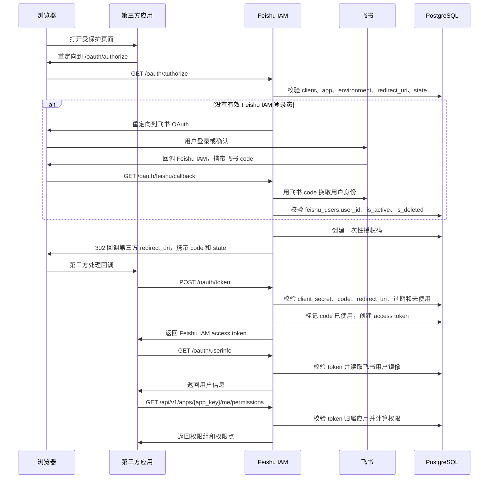

# Feishu IAM v0.4.0 SSO Provider 设计

日期：2026-05-16
状态：已确认路线，待实施计划

## 1. 版本目标

`v0.4.0` 是 Feishu IAM 的 SSO Provider 最小可用闭环版本。本版本在 `v0.2.x` 飞书身份镜像和 `v0.3.0` 应用权限模型之上，实现一个真实内部 Web 系统接入 Feishu IAM 登录、换取 Feishu IAM token、获取用户信息和查询权限清单的完整流程。

本版本完成后，第三方应用应该可以：

1. 在 Feishu IAM 中配置应用环境、回调地址和 client。
2. 把浏览器重定向到 Feishu IAM `/oauth/authorize`。
3. 由 Feishu IAM 在需要时跳转飞书完成身份确认。
4. 接收 Feishu IAM 回调并获得一次性授权码。
5. 使用 `/oauth/token` 换取 Feishu IAM access token。
6. 使用 `/oauth/userinfo` 获取当前登录用户信息。
7. 使用 `/api/v1/apps/{app_key}/me/permissions` 获取当前用户在本应用下的权限组和权限点。

本版本不追求完整 OIDC 协议兼容。目标是先跑通企业内部系统接入闭环，并把安全边界、错误体验、审计和接入文档做扎实。

## 2. 设计原则

- Feishu IAM 是统一 SSO Provider，第三方应用只对接 Feishu IAM。
- 飞书仍然是身份和组织主数据的唯一来源。
- 第三方应用不保存飞书 `app_id` 或 `app_secret`。
- Feishu IAM access token 使用服务端不透明 token，不把权限清单固化进 token。
- 权限变化后，第三方应用通过重新调用权限接口感知最新权限。
- 回调地址必须精确匹配，不允许通配符。
- `client_secret` 和 access token 只能保存哈希或加密密文，明文只允许在创建或轮换时展示一次。
- 所有 SSO 写操作和高风险事件必须写入审计或安全日志。
- 登录失败必须展示 Feishu IAM 统一错误页，不能暴露裸 JSON、堆栈或框架默认错误。

## 3. 范围

### 3.1 纳入范围

- 应用环境模型：`dev`、`test`、`prod`。
- 应用 client 模型：`client_id`、`client_secret` 创建、禁用和最小轮换。
- 应用回调地址模型：按环境保存精确回调地址。
- OAuth 授权码流程子集：`authorization_code` grant。
- 飞书 OAuth 登录入口和 Feishu IAM 飞书回调处理。
- Feishu IAM 一次性授权码，短有效期，只能使用一次。
- Feishu IAM 不透明 access token，服务端存储，支持过期和撤销。
- `/oauth/authorize`、`/oauth/token`、`/oauth/userinfo`、`/oauth/revoke`。
- `/api/v1/apps/{app_key}/me/permissions` 应用侧权限查询接口。
- SSO 统一错误页。
- 管理端最小配置区：环境、回调地址、client 创建、secret 一次性展示、禁用 client。
- 平台 API：环境、回调地址、client 管理接口。
- 审计日志和安全事件记录。
- 中文接入文档、curl 示例、错误码、验收 checklist 和 Agent 接入指南。
- 自动化测试和本地 mock 第三方应用验收说明。

### 3.2 排除范围

- 不实现完整 OIDC Discovery。
- 不实现 JWKS 和 ID Token。
- 不实现 SAML。
- 不实现完整管理员登录体系重做。
- 不默认启用 refresh token。
- 不实现权限计算缓存。
- 不实现第三方业务资源级权限、deny 规则、数据范围权限或 ABAC。
- 不同步飞书角色或飞书用户组。
- 不提供 client、token、审计日志的硬删除能力。
- 不实现多租户 SaaS 化。

## 4. 核心流程



## 5. 数据模型

### 5.1 `application_environments`

应用环境属于 `applications`。

字段建议：

- `id`：内部主键。
- `application_id`：所属应用。
- `environment_key`：`dev`、`test`、`prod`。
- `name`：环境名称。
- `status`：`active` 或 `disabled`。
- `created_at`、`updated_at`。

约束：

- 同一应用下 `environment_key` 唯一。
- 禁用环境下的 client 不可发起登录。

### 5.2 `application_redirect_uris`

字段建议：

- `id`：内部主键。
- `application_id`：所属应用。
- `environment_id`：所属环境。
- `redirect_uri`：完整回调地址。
- `status`：`active` 或 `disabled`。
- `created_at`、`updated_at`。

约束：

- 同一环境下 `redirect_uri` 唯一。
- 必须精确匹配，不支持通配符、前缀匹配或正则匹配。
- `prod` 环境必须使用 `https`。
- `dev` 环境允许 `http://localhost`、`http://127.0.0.1` 和 `http://[::1]`。

### 5.3 `application_clients`

字段建议：

- `id`：内部主键。
- `application_id`：所属应用。
- `environment_id`：所属环境。
- `client_id`：公开 client 标识。
- `client_secret_hash`：secret 哈希。
- `name`：client 名称。
- `status`：`active` 或 `disabled`。
- `last_used_at`：最后使用时间。
- `created_at`、`updated_at`。

约束：

- `client_id` 全局唯一。
- 明文 `client_secret` 只在创建或轮换时返回一次。
- 禁用 client 后不可发起登录、换 token 或撤销 token。

最小轮换策略：

- 轮换时生成一个新的 `client_secret` 并替换当前哈希。
- 旧 secret 在替换后立即失效。
- 轮换动作写入审计日志。
- 不在 `v0.4.0` 实现多 secret 并存和宽限期。

### 5.4 `oauth_authorization_codes`

字段建议：

- `id`：内部主键。
- `code_hash`：授权码哈希。
- `application_id`：所属应用。
- `environment_id`：所属环境。
- `client_id`：client 标识。
- `redirect_uri`：本次请求校验过的回调地址。
- `feishu_user_id`：飞书 `user_id`。
- `scope`：授权范围，第一版固定为 `openid profile permissions` 的子集。
- `state`：第三方传入的 state。
- `expires_at`：过期时间。
- `used_at`：使用时间。
- `created_at`。

约束：

- 授权码有效期默认 5 分钟。
- 授权码只能使用一次。
- 换 token 时必须提交同一个 `redirect_uri`。
- 授权码明文不落库，只保存哈希。

### 5.5 `oauth_access_tokens`

字段建议：

- `id`：内部主键。
- `token_hash`：access token 哈希。
- `application_id`：所属应用。
- `environment_id`：所属环境。
- `client_id`：client 标识。
- `feishu_user_id`：飞书 `user_id`。
- `scope`：授权范围。
- `expires_at`：过期时间。
- `revoked_at`：撤销时间。
- `last_used_at`：最后使用时间。
- `created_at`。

约束：

- access token 默认有效期 2 小时。
- token 明文只在 `/oauth/token` 响应中返回一次。
- token 被撤销、过期、应用禁用、环境禁用、client 禁用或用户不可用时，应用侧 API 必须拒绝访问。

### 5.6 `security_events`

字段建议：

- `id`：内部主键。
- `event_type`：事件类型。
- `application_id`：关联应用，可为空。
- `client_id`：关联 client，可为空。
- `feishu_user_id`：关联用户，可为空。
- `result`：`success` 或 `failed`。
- `reason_code`：失败原因码。
- `summary`：中文摘要。
- `ip`：请求 IP。
- `user_agent`：User-Agent。
- `request_id`：请求 ID。
- `created_at`。

记录范围：

- 登录成功和失败。
- code 换 token 失败。
- token 撤销。
- redirect_uri 不匹配。
- client_secret 校验失败。
- 禁用用户尝试登录。

## 6. API 设计

### 6.1 `GET /oauth/authorize`

请求参数：

- `response_type`：固定为 `code`。
- `client_id`：应用 client。
- `redirect_uri`：第三方回调地址。
- `state`：第三方防 CSRF 参数，必填。
- `scope`：可选，默认 `openid profile permissions`。

校验规则：

- `response_type` 必须为 `code`。
- client 必须存在且状态为 `active`。
- 应用和环境必须为 `active`。
- `redirect_uri` 必须在当前 client 所属环境中精确登记。
- `state` 必须是非空字符串。

成功行为：

- 如无有效 Feishu IAM 登录态，跳转飞书 OAuth。
- 如已有有效登录态，直接发放授权码并回调第三方。

失败行为：

- `v0.4.0` 授权流程失败时统一展示 Feishu IAM 错误页。
- 当前版本不将 authorize 错误回调到第三方 `redirect_uri`；第三方应用只需要处理成功回调中的 `code` 和 `state`。

### 6.2 `GET /oauth/feishu/callback`

该端点只处理 Feishu IAM 自己配置的飞书 OAuth 回调，不对第三方应用开放。

处理规则：

- 校验内部登录 state。
- 使用飞书 code 获取用户身份。
- 通过飞书 `user_id` 查找本地 `feishu_users`。
- 用户不存在、`is_active=false` 或 `is_deleted=true` 时拒绝登录。
- 创建短期 Feishu IAM 登录态。
- 回到原始授权请求并生成授权码。

### 6.3 `POST /oauth/token`

请求格式使用 `application/x-www-form-urlencoded`。

请求参数：

- `grant_type`：固定为 `authorization_code`。
- `code`：授权码。
- `redirect_uri`：必须与授权请求一致。
- `client_id`：client 标识。
- `client_secret`：client secret。

成功响应：

```json
{
  "access_token": "biat_...",
  "token_type": "Bearer",
  "expires_in": 7200,
  "scope": "openid profile permissions"
}
```

失败规则：

- 授权码不存在、过期、已使用或与 client 不匹配时返回稳定错误。
- client secret 错误时记录安全事件。
- 同一个授权码并发换 token 只能成功一次。

### 6.4 `GET /oauth/userinfo`

认证方式：

```text
Authorization: Bearer <access_token>
```

成功响应：

```json
{
  "sub": "ou_xxx",
  "user_id": "ou_xxx",
  "open_id": "ou_xxx",
  "union_id": "on_xxx",
  "name": "张三",
  "avatar": {},
  "email": "zhangsan@example.com",
  "employee_no": "10001",
  "job_title": "工程师"
}
```

字段规则：

- `sub` 使用飞书 `user_id`。
- `open_id`、`union_id` 按本地镜像返回，可为空。
- 手机号默认不返回。
- 用户不可用时返回认证失败，不返回历史身份信息。

### 6.5 `POST /oauth/revoke`

请求参数：

- `token`：待撤销 access token。
- `client_id`：client 标识。
- `client_secret`：client secret。

行为：

- token 存在且属于该 client 时设置 `revoked_at`。
- token 不存在也返回成功，避免泄露 token 是否存在。
- client 校验失败返回稳定错误并记录安全事件。

### 6.6 `GET /api/v1/apps/{app_key}/me/permissions`

认证方式：

```text
Authorization: Bearer <access_token>
```

校验规则：

- token 必须有效且未撤销。
- token 所属应用必须与路径中的 `app_key` 一致。
- 应用、环境、client 和飞书用户必须仍然可用。

成功响应沿用 `v0.3.0` 权限计算结构：

```json
{
  "app_key": "finance",
  "user_id": "ou_xxx",
  "permission_groups": [
    {
      "key": "finance.invoice_manager",
      "name": "发票管理员"
    }
  ],
  "permission_points": [
    {
      "key": "finance.invoice.read",
      "name": "查看发票"
    }
  ],
  "matched_roles": [
    {
      "key": "invoice_manager",
      "name": "发票管理员"
    }
  ],
  "computed_at": "2026-05-16T00:00:00.000Z"
}
```

## 7. 平台 API 与管理端

平台 API 沿用 `PLATFORM_ADMIN_TOKEN` 保护。

新增平台 API：

- `POST /api/v1/platform/applications/{app_key}/environments`
- `GET /api/v1/platform/applications/{app_key}/environments`
- `PATCH /api/v1/platform/applications/{app_key}/environments/{environment_id}`
- `POST /api/v1/platform/applications/{app_key}/environments/{environment_id}/enable`
- `POST /api/v1/platform/applications/{app_key}/environments/{environment_id}/disable`
- `POST /api/v1/platform/applications/{app_key}/environments/{environment_id}/redirect-uris`
- `GET /api/v1/platform/applications/{app_key}/environments/{environment_id}/redirect-uris`
- `POST /api/v1/platform/applications/{app_key}/redirect-uris/{redirect_uri_id}/disable`
- `POST /api/v1/platform/applications/{app_key}/environments/{environment_id}/clients`
- `GET /api/v1/platform/applications/{app_key}/environments/{environment_id}/clients`
- `POST /api/v1/platform/applications/{app_key}/clients/{client_id}/rotate-secret`
- `POST /api/v1/platform/applications/{app_key}/clients/{client_id}/disable`
- `POST /api/v1/platform/applications/{app_key}/clients/{client_id}/enable`

管理端最小闭环：

- 在应用详情中增加“接入配置”页签。
- 展示环境列表、回调地址列表和 client 列表。
- 支持新增回调地址。
- 支持创建 client，并在创建成功后一次性展示 secret。
- 支持轮换 secret，并在轮换成功后一次性展示新 secret。
- 支持禁用 client 和回调地址。
- 所有表单错误使用后端稳定错误消息展示。

## 8. 错误处理

JSON API 错误结构：

```json
{
  "error": {
    "code": "OAUTH_REDIRECT_URI_UNTRUSTED",
    "message": "回调地址未登记或已禁用",
    "request_id": "req_..."
  }
}
```

授权流程错误行为：

- `/oauth/authorize` 和 `/oauth/feishu/callback` 渲染统一 HTML 错误页。
- 当前版本不向第三方 `redirect_uri` 回调 `error` 或 `error_description` 参数。

核心错误码：

- `OAUTH_RESPONSE_TYPE_UNSUPPORTED`：不支持的 `response_type`。
- `OAUTH_CLIENT_NOT_FOUND`：client 不存在。
- `OAUTH_CLIENT_DISABLED`：client 已禁用。
- `OAUTH_APPLICATION_DISABLED`：应用已禁用。
- `OAUTH_ENVIRONMENT_DISABLED`：环境已禁用。
- `OAUTH_REDIRECT_URI_UNTRUSTED`：回调地址不匹配。
- `OAUTH_STATE_REQUIRED`：缺少 state。
- `OAUTH_LOGIN_STATE_INVALID`：飞书登录状态失效。
- `OAUTH_FEISHU_CLIENT_ERROR`：飞书登录服务暂时不可用。
- `OAUTH_USER_NOT_ACTIVE`：飞书用户不可登录。
- `OAUTH_CODE_INVALID`：授权码无效。
- `OAUTH_CODE_EXPIRED`：授权码已过期。
- `OAUTH_CODE_USED`：授权码已使用。
- `OAUTH_CLIENT_CREDENTIALS_INVALID`：client 不存在或 secret 错误。
- `OAUTH_TOKEN_MISSING`：缺少 Bearer token。
- `OAUTH_TOKEN_INVALID`：token 无效。
- `OAUTH_TOKEN_EXPIRED`：token 已过期。
- `OAUTH_TOKEN_REVOKED`：token 已撤销。
- `OAUTH_TOKEN_CONTEXT_DISABLED`：token 关联的应用、环境或 client 已停用。
- `OAUTH_TOKEN_USER_UNAVAILABLE`：token 关联用户不可用。
- `OAUTH_APP_KEY_MISMATCH`：token 所属应用与路径应用不一致。

统一错误页必须包含：

- 标题：“无法完成登录”。
- 用户可理解的失败原因。
- `request_id`。
- 返回原系统重新发起登录的提示。
- 管理员排查提示。

错误页不得包含：

- 飞书 app secret。
- client secret。
- access token。
- 授权码明文。
- 数据库错误堆栈。
- 框架默认异常页面。

## 9. 审计与安全

必须写审计日志的操作：

- 创建、更新、启用、禁用环境。
- 创建、禁用回调地址。
- 创建 client。
- 轮换 client secret。
- 启用、禁用 client。
- 撤销 token。

必须写安全事件的操作：

- 登录成功。
- 登录失败。
- redirect_uri 不匹配。
- client secret 校验失败。
- 授权码重复使用。
- 禁用用户尝试登录。
- token 过期、撤销或跨应用使用。

安全约束：

- 授权码、access token、client secret 明文不落库。
- access token 前缀使用 `biat_`，便于排查来源但不承载业务含义。
- 授权码前缀使用 `biac_`。
- token 比对使用恒定时间比较。
- token 和 secret 日志输出必须脱敏。
- access token 不包含权限清单。
- 权限查询每次调用 `v0.3.0` 权限计算服务。

## 10. 测试策略

后端测试覆盖：

- 创建环境、回调地址和 client。
- `client_secret` 只在创建和轮换响应中出现。
- secret 哈希保存，列表接口不返回 secret。
- `redirect_uri` 精确匹配。
- `prod` 环境拒绝非 HTTPS 回调地址。
- `dev` 环境允许 localhost 回调地址。
- `/oauth/authorize` 参数校验。
- 飞书回调后禁用用户不可登录。
- 授权码过期、重复使用和并发换 token。
- `/oauth/token` 校验 client secret 和 redirect_uri。
- `/oauth/userinfo` 返回当前用户信息。
- `/oauth/revoke` 撤销 token。
- `/api/v1/apps/{app_key}/me/permissions` 拒绝跨应用 token。
- token 过期、撤销、client 禁用、应用禁用后不可访问。
- SSO 写操作生成审计日志。
- 登录失败生成安全事件。

管理端测试覆盖：

- 接入配置页渲染环境、回调地址和 client。
- 创建回调地址时展示精确错误。
- 创建 client 后一次性展示 secret。
- 轮换 secret 后旧 secret 不能换 token。
- 禁用 client 后不能登录。

验收命令：

```bash
pnpm check
pnpm prisma:validate
docker compose -f deploy/docker-compose.yml config --quiet
```

手动验收：

1. 创建应用 `finance`。
2. 创建 `dev` 环境。
3. 登记 `http://localhost:5179/callback`。
4. 创建 client 并记录一次性展示的 secret。
5. 使用 mock 第三方应用跳转 `/oauth/authorize`。
6. 完成飞书登录。
7. 第三方应用收到 code。
8. 后端用 code 换 token。
9. 调用 `/oauth/userinfo`。
10. 调用 `/api/v1/apps/finance/me/permissions`。
11. 撤销 token 后确认两个应用侧接口都拒绝访问。

## 11. 文档要求

新增文档：

- `docs/sso-provider.md`

文档必须包含：

- SSO 流程图。
- 管理后台配置步骤。
- 第三方应用接入步骤。
- OAuth 端点参数说明。
- curl 示例。
- 错误码表。
- mock 第三方应用验收流程。
- Agent 接入指南。
- 安全注意事项。

Agent 接入指南必须明确：

- 第三方应用只保存 Feishu IAM client，不保存飞书凭证。
- `state` 必须生成并校验。
- `redirect_uri` 必须和后台登记值完全一致。
- access token 只作为 Bearer token 调用 Feishu IAM。
- 权限判断以 `/api/v1/apps/{app_key}/me/permissions` 返回值为准。

## 12. 版本边界

`v0.4.0` 只要完成授权码最小闭环即可发布。完整 OIDC、refresh token 默认开启、管理员登录体系和权限缓存不进入本版本。

发布前必须确认：

- 一个 mock 第三方应用能跑通完整登录。
- 禁用用户、禁用应用、禁用 client 和错误回调地址都能稳定失败。
- 错误页不会暴露敏感信息。
- `CHANGELOG.md`、`README.md`、`AGENTS.md` 和 Codex 会话归档已更新。
